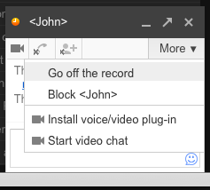
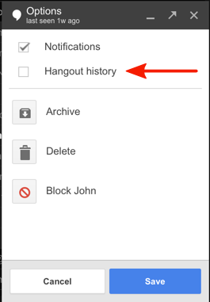
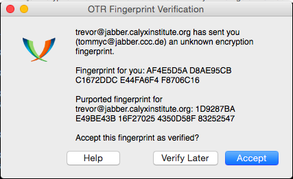
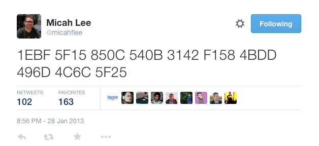

# Encryption Works: A Guide to Protecting Your Privacy for Journalists, Sources, and Everyone Else

Warning: This guide has not updated in over a year. Freedom of the Press Foundation is working on an updated version. If you're interested in contributing, or have ideas for what this guide should cover, please submit issues on <a href="https://github.com/freedomofpress/encryption-works">GitHub</a>

> *Encryption works. Properly implemented strong crypto systems are one of the few things that you can rely on. Unfortunately, endpoint security is so terrifically weak that NSA can frequently find ways around it.*
> 
> — Edward Snowden, answering questions live on the [Guardian's website](http://www.guardian.co.uk/world/2013/jun/17/edward-snowden-nsa-files-whistleblower)

The NSA is the biggest, best funded spy agency the world has ever seen. They spend billions upon billions of dollars each year doing everything they can to vacuum up the digital communications of most humans on this planet that have access to the Internet and the phone network. And as the recent reports in the Guardian and Washington Post show, even domestic American communications are not safe from their net.

Defending yourself against the NSA, or any other government intelligence agency, is not simple, and it's not something that can be solved just by downloading an app. But thanks to the dedicated work of civilian cryptographers and the free and open source software community, it's still possible to have privacy on the Internet, and the software to do it is freely available to everyone. This is especially important for journalists communicating with sources online.

## Threat Model

The NSA is a powerful adversary. If you are its direct target, you have to go to great lengths to communicate in private, and even if you're not, billions of innocent Internet users get caught in the NSA's dragnet too.

While the tools and advice in this paper are aimed at protecting your privacy from the NSA's collection methods, the same advice can be used to increase your computer security against any adversary. It's important to remember that other governments, including China and Russia, spend massive amounts of money of their own high-tech surveillance equipment and are known to specifically target journalists and sources. In the US, bad digital security can cost whistleblowers their freedom, but in other countries it can cost both journalists and sources their lives. A [recent example from Syria](http://www.cjr.org/feature/the_spy_who_came_in_from_the_c.php?page=all) illustrates how careless digital security can have tragic results.

But changing some basic software practices could award you a great deal of privacy, even if it doesn't keep you secure against targeted attacks by governments. This paper explores methods you can use in both cases.

## Crypto Systems

> *We discovered something. Our one hope against total domination. A hope that with courage, insight and solidarity we could use to resist. A strange property of the physical universe that we live in.*
> 
> *The universe believes in encryption.*
> 
> *It is easier to encrypt information than it is to decrypt it.*
> 
> — Julian Assange, in the introduction of Cypherpunks: Freedom and the Future of the Internet

Encryption is the process of taking a plaintext message and a randomly generated key and doing mathematical operations with the two until all that's left is a scrambled, ciphertext version of the message. Decryption is taking the ciphertext and the right key and doing more mathematical operations until the plaintext is recovered. This field is called cryptography, or crypto for short. A crypto algorithm, what mathematical operations to do and how to do them, is called a cipher.

To encrypt something you need the right key, and you need the right key to decrypt it too. If the crypto software is implemented properly, if the math is sound, and if the keys are secure, all of the combined computing power on Earth cannot break this encryption.

We build crypto systems that depend on problems in mathematics that we believe to be hard, such as the difficulty in factoring large numbers. Unless there are mathematical breakthroughs that make these problems easier—and the NSA is keeping them secret from the rest of the world—breaking crypto that relies on them for security is unfeasible.

The design of crypto systems and ciphers should be completely public. The only way to ensure that the cipher itself doesn't have a critical flaw is to publish how it works, to have many eyes scrutinizing it in detail, and to let it weather real-world attacks in the wild to work out the bugs. The inner workings of most crypto that we use on a daily basis, like [HTTPS](https://en.wikipedia.org/wiki/Https), the technology that makes it possible to safely type credit card numbers and passwords into website forms, is completely public. An attacker that knows every single detail about how the encryption works should still fail to break the encryption without possessing the key. Crypto that is proprietary, and its underlying code secret, cannot be trusted to be secure.

Here's an important question to ask when assessing if a service or app that uses encryption is secure: Is it possible for the service provider itself to circumvent the encryption? If so, you cannot trust the security of the service. Many services like [Skype](http://arstechnica.com/security/2013/05/think-your-skype-messages-get-end-to-end-encryption-think-again/) and [Hushmail](http://www.wired.com/threatlevel/2007/11/hushmail-to-war/) promise "end-to-end" encryption, but often times it still means that the services themselves have the keys to decrypt the product. True end-to-end encryption means that the service provider cannot look at your communications even if they wanted to.

Another important fact to know about encryption is that it's about much more than protecting the privacy of communications. It can be used to "digitally sign" messages in a way that proves that the message originated from the person you expected it to. It can be used to build digital currencies like Bitcoin, and it can be used to build anonymity networks like Tor.

Encryption can also be used to prevent people from installing iPhone apps that didn't come from the App Store, to prevent people from recording movies directly from Netflix, and to prevent people from installing Linux on a Windows 8 tablet. And it can also be used to prevent [man-in-the-middle](https://en.wikipedia.org/wiki/Man-in-the-middle_attack) (MITM) attackers from adding malware to otherwise legitimate software updates.

In short, encryption encompasses a whole host of uses, but here we are focused on how we can use it to securely and privately communicate.

## Software You Can Trust

When Snowden uses the term "endpoint security" he means the security of the computers on either end of the conversation that are doing the encrypting and the decrypting, as opposed to the security of the message when it’s in transit. If you send an encrypted email to a friend but you have a keylogger on your computer that's logging the entire message, as well as the passphrase that's protecting your encryption keys, your encryption isn't worth very much.

Since Freedom of the Press Foundation board members Glenn Greenwald and Laura Poitras broke the NSA dragnet surveillance stories, a lot more information about US spy agencies has been made public. Specifically, Bloomberg wrote about [voluntary information sharing programs between US companies and US spy agencies](http://www.bloomberg.com/news/2013-06-14/u-s-agencies-said-to-swap-data-with-thousands-of-firms.html).

So far the most shocking revelation about these information sharing programs is that Microsoft has a policy of giving information about vulnerabilities in its software to the US government before it releases security updates to the public. The article says:

> Microsoft Corp. (MSFT), the world's largest software company, provides intelligence agencies with information about bugs in its popular software before it publicly releases a fix, according to two people familiar with the process. That information can be used to protect government computers and to access the computers of terrorists or military foes.

This means that it's likely that NSA has been handed the keys to any computer running Windows, Office, Skype, or other Microsoft software. If you're running this software on your computer, it's likely that, with enough effort, the NSA could compromise your computer, and thus your encrypted communications, if you became a target.

We've also learned from the [New York Times](http://www.nytimes.com/2013/06/20/technology/silicon-valley-and-spy-agency-bound-by-strengthening-web.html?pagewanted=all&_r=1&) that Skype, software that outside the security community has long had a reputation of being a secure way to communicate, has been feeding private conversations to the US government for the last five years.

> Skype, the Internet-based calling service, began its own secret program, Project Chess, to explore the legal and technical issues in making Skype calls readily available to intelligence agencies and law enforcement officials, according to people briefed on the program who asked not to be named to avoid trouble with the intelligence agencies.
> 
> Project Chess, which has never been previously disclosed, was small, limited to fewer than a dozen people inside Skype, and was developed as the company had sometimes contentious talks with the government over legal issues, said one of the people briefed on the project. The project began about five years ago, before most of the company was sold by its parent, eBay, to outside investors in 2009. Microsoft acquired Skype in an $8.5 billion deal that was completed in October 2011.
> 
> A Skype executive denied last year in a blog post that recent changes in the way Skype operated were made at the behest of Microsoft to make snooping easier for law enforcement. It appears, however, that Skype figured out how to cooperate with the intelligence community before Microsoft took over the company, according to documents leaked by Edward J. Snowden, a former contractor for the N.S.A. One of the documents about the Prism program made public by Mr. Snowden says Skype joined Prism on Feb. 6, 2011.

Proprietary software, such as much of what's released by Microsoft, Apple, and Google, has another flaw. It's much more difficult for users to independently verify that secret backdoors don't exist at the clandestine demands of the surveillance state. Though recent reports have shown that many companies hand over an unknown amount of information in response to FISA requests, none have been shown to have direct backdoors into their systems.

There is other software that's more reliable in this regard. [Free and open source software](https://www.fsf.org/about/what-is-free-software) is not always user friendly and it's not always secure. However when it's developed in the open, with open bug trackers, open mailing lists, open governing structures, and open source code, it's much more difficult for these projects to have a policy of betraying their users like Microsoft has.

GNU/Linux is an operating system that's composed entirely of free and open source software. Examples of GNU/Linux distributions include [Ubuntu](http://www.ubuntu.com/), [Debian](http://www.debian.org/), and [Fedora Core](https://fedoraproject.org/). It's the most popular free software alternative to Windows and Mac OS X.

While free software projects still might include malicious code (see the [Underhanded C Contest](http://underhanded.xcott.com/)), the person writing the code needs to hide it cleverly and hope none of the other developers, or downstream GNU/Linux package maintainers who prepare and compile the source code of projects to include in their distributions, notice.

In the 1990s, when civilian cryptography was becoming popular and the US government was doing [everything](https://en.wikipedia.org/wiki/Phil_Zimmermann#Criminal_investigation) [they could](https://en.wikipedia.org/wiki/Clipper_chip) to prevent it, the "cypherpunk" movement was born. Many pieces of software intended to bring encryption to the people grew out of that movement.

> *Cypherpunks write code. We know that someone has to write software to defend privacy, and since we can't get privacy unless we all do, we're going to write it. We publish our code so that our fellow Cypherpunks may practice and play with it. Our code is free for all to use, worldwide. We don't much care if you don't approve of the software we write. We know that software can't be destroyed and that a widely dispersed system can't be shut down.*
> 
> — Eric Hughes, in his 1993 Cypherpunk Manifesto

That code, that's open and public so that fellow cypherpunks may practice and play with it, which anyone in the world can freely use, makes the basis of the software and protocols that we can trust: TLS (the encryption that powers HTTPS), LUKS ([disk encryption](https://en.wikipedia.org/wiki/Disk_encryption) built-in to GNU/Linux), OpenPGP, Off-the-Record, and Tor.

The [Tactical Technology Collective](https://tacticaltech.org/) has built a [great guide to open source security software that you can trust](https://tacticaltech.org/security-box) to keep your communications private from surveillance. It's important to remember that just using this software, and even using it perfectly, cannot guarantee the security of your crypto. For example, we have no idea if Apple has handed over [zero day](https://en.wikipedia.org/wiki/Zero-Day_Attack) vulnerabilities to the NSA for iOS like Microsoft is reported to have done. ChatSecure, which lets you have encrypted chat conversations on iOS devices, is only as secure as the operating system that it's running on.

It's important to remember that just because you use free software doesn't mean you can't get hacked. People find zero day exploits for free software all the time, and sometimes sell them to governments and other malicious attackers. Free software users still download malicious attachments in their email, and they still often have badly configured and easily exploited services on their computers. And even worse, malware is often very good at hiding. If a free software user gets malware on their computer, it might stay there until the user formats their hard drive.

Tails, which is a live DVD and live USB GNU/Linux distribution that I will discuss in detail below, solves many of these problems.

## Anonymize Your Location with Tor

Tor is a software service that allows you to use the Internet while concealing your IP address, which is, in general, a fairly accurate representation of your location. The [Tor](https://www.torproject.org/) network is made up of over 3,600 volunteer servers called nodes. When someone uses the Tor network to visit a website their connection gets bounced through three of these nodes (called a circuit) before finally exiting into the normal Internet. Anyone intercepting traffic will think your location is the final node which your traffic exits from.

It's important to remember that just because your connection to the Internet may be anonymous that doesn't magically make it secure. EFF has made a great [visualization of how Tor and HTTPS can work together to protect your privacy](https://www.eff.org/pages/tor-and-https).

Like all good cryptography software, Tor is free software, complete with an open [bug tracker](https://trac.torproject.org/projects/tor), [mailing lists](https://www.torproject.org/docs/documentation#MailingLists), and [source code](https://gitweb.torproject.org/tor.git?a=tree;hb=HEAD).

Documentation for Tails, the live GNU/Linux distribution that forces all of the user's network traffic to go through the Tor network, has [this to say](https://tails.boum.org/doc/about/warning/index.en.html#index7h1) about global adversaries:

> A global passive adversary would be a person or an entity able to monitor at the same time the traffic between all the computers in a network. By studying, for example, the timing and volume patterns of the different communications across the network, it would be statistically possible to identify Tor circuits and thus matching Tor users and destination servers.

We still don't know whether or not NSA or GCHQ counts as a global adversary, but we do know that they monitor a large portion of the Internet. It's too early to know for sure how often these intelligence agencies can defeat the anonymity of the Tor network.

Even if they can, using Tor still gives us many advantages. It makes their job much harder, and we leave much less identifying data on the servers we connect to through the Tor network. It makes it much harder to be the victim of a MITM attack at our local network or ISP level. And even if some Tor circuits can be defeated by a global adversary, if enough people are getting their traffic routed through the same Tor nodes at the same time, it might be difficult for the adversary to tell which traffic belongs to which circuits.

The easiest way to start using Tor is to download and install the [Tor Browser Bundle](https://www.torproject.org/download/download-easy.html.en).

When Snowden [was answering questions on Guardian's website](http://www.guardian.co.uk/world/2013/jun/17/edward-snowden-nsa-files-whistleblower) from a "secure Internet connection", he was probably routing his traffic through the Tor network. He may have also been using a [bridge](https://bridges.torproject.org/) to connect to the Tor network to make the fact that he was using Tor from his IP address less obvious to eavesdroppers.

## Off-the-Record (OTR) Chat

The best way to end-to-end encrypt your instant messages is to use something called OTR chat with a Jabber/XMPP account. While it's possible to use OTR with Google Talk or Facebook Chat, we don't recommend it because these services could drop support for OTR without warning. Plus, Jabber leaks less metadata than these services, especially if both people are using the same Jabber server.

### How To Use

To use OTR, you'll need to download additional software with your IM client. If you use Windows you can download and install [Pidgin](https://pidgin.im/) and the [OTR plugin](http://www.cypherpunks.ca/otr/). If you use Mac OS X you can download and install [Adium](https://adium.im), a free software chat application that includes OTR support. If you use GNU/Linux you can install the pidgin and pidgin-otr packages.

There are also OTR clients available for Android phones, called [Gibberbot](https://play.google.com/store/apps/details?id=info.guardianproject.otr.app.im), and for iOS, called [ChatSecure](http://chrisballinger.info/apps/chatsecure/).

For a full explanation of how it works and how to set it up, check out the Intercept's guide to [chatting in secret while we're all being watched](https://firstlook.org/theintercept/2015/07/14/communicating-secret-watched/). As an added bonus, the Intercept also explains how to set up OTR to work with Tor so you can keep your chats both anonymous and encrypted.

Like PGP, OTR is used for two things: **encrypting the contents** of real-time instant message conversations and **verifying the identity** of people you chat with. Identity verification is important, and something many OTR users neglect to do. While OTR is more user-friendly than other types of encryption, there are some things you should know about OTR to understand it fully and know what attacks against it are possible.

OTR encrypts the contents of your chats but not the metadata related to them -- who you talk to, how often, and when. You can use Google Talk and Facebook Chat with OTR, but we know that these services comply with surveillance requests from many governments that leave your metadata exposed, even if you're encrypting the content of your IM conversations. This is another reason to use XMPP, since it supports sending data over the Tor network, adding an additional layer of protection from metadata analysis.

For this reason, Freedom of the Press Foundation recommends using a chat service that doesn't collaborate with intelligence agencies, such as Jabber. It's not a guarantee against metadata gathering, but it's better than nothing. OTR works with Google Talk and Facebook Chat, but Freedom of the Press Foundation recommend using XMPP, also known as Jabber. Jabber is an open protocol, and, unlike Facebook and Google, makes it harder for conversation metadata to be found. This is good for journalists who want to speak more securely to whistleblowers.

Jabber servers you can get free accounts with include [Calyx Institute](https://www.calyxinstitute.org/projects/public_jabber_xmpp_server), [Riseup](https://help.riseup.net/en/chat) and [Duck Duck Go](https://duck.co/blog/post/4/xmpp-services-at-duckduckgo).

### Keys

When you start using OTR, your chat client generates an encryption key and stores it in a file on your hard drive. If your computer or smartphone gets lost, stolen, or infected with malware, you should assume your key has been compromised -- an attacker could impersonate you. If this happens, you should generate a new key and reverify yourself with your chat clients.

When you start a new OTR session, your OTR software and your friend's OTR software send a series of messages back and forth to agree upon a new session key. This temporary encryption key, which is only known by your IM clients and is never sent over the Internet, is then used to encrypt and decrypt messages. When the session is finished both clients forget the key. If you start chatting with the same person later, your clients generate a brand new session key.

In this way, even if an eavesdropper is logging all of your encrypted OTR conversations -- which NSA believes it is legally [allowed to do](http://www.forbes.com/sites/andygreenberg/2013/06/20/leaked-nsa-doc-says-it-can-collect-and-keep-your-encrypted-data-as-long-as-it-takes-to-crack-it/) in many cases, even if you're a US citizen and they don't have a warrant or probable cause -- and later they compromise your OTR key, they cannot use it to go back and decrypt your old conversations.

This property is called forward secrecy, and it is a feature that OTR has which PGP does not. If your PGP secret key (more on this below) gets compromised, and the attacker has access to all the encrypted messages you've received, they can go back and decrypt them all.

### A Note About Gmail's "off the record" function.

When using Google Talk for instant messaging, there's a setting to "Go off the record," and it's useful to differentiate between this feature and what the Off-The-Record encryption software offers.

 

Essentially, going off the record in Google Talk (or disabling the "Hangout history" function, if you've updated to Hangouts) does not store the conversation log in either conversation participant's Gmail chat history. This may seem more secure, but it only prevents the conversation participants from viewing the history of their own conversations. There is no guarantee or way of determining whether or not Google retains a copy of your conversation.

By comparison, conversations over Google Talk which use Off-The Record message encryption are only readable to the participants, and Google is never able to read the contents of your conversation. This is far more secure.

### Verifying A Contact's OTR Fingerprint

If you want to use OTR to talk privately with friends, colleagues, and sources, they need to be using OTR too. An encrypted chat requires both people have keys, so if you're using OTR and you're chatting with a colleague who's using facebook.com, you cannot have an encrypted conversation.

When you start an encrypted OTR session, your chat software will tell you something like this:

> *** Encrypted OTR chat initiated. tommyc@jabber.ccc.de's identity not verified.

With OTR, each key has a fingerprint, a string of numbers and letters you can use to verify someone's identity. Mine is AF4E5D5A D8AE95CB C1672DDC E44FA6F4 F8706C16. Unlike session keys, encryption keys are persistent: the fingerprint will stay the same across numerous conversations unless you change device or are the victim of a man-in-the-middle attack.

It's worth remembering that fingerprints are unique to devices, not accounts. This means that if I chat with people on my Jabber account from my Mac and from my Android phone, those contacts will have two fingerprints for me.  It's important to repeat the verification step on each device with each contact you talk to.

In the screenshot above, you can see the OTR fingerprints for both users in the session. The other person should see the exact same fingerprints. In order to be sure that both parties are seeing the correct fingerprints you both need to find some other secure channel to verify fingerprints. You could meet up in person, or talk on the phone if you can recognize their voice, or send a PGP encrypted and signed email.

OTR fingerprints are 40 characters. It's statistically impossible to generate two OTR keys that have the same fingerprint. However, it is possible to generate an OTR key that isn't a collision but looks like one on cursory inspection. For example, the first few characters and last few characters could be the same with different characters in the middle. For this reason, it's important to compare each of the 40 characters to be sure you have the correct OTR key.

Without verifying keys you have no way to know that you're not falling victim to an undetected, successful MITM attack. Even if the person you're talking to is definitely your real friend because she know things that only she would know, and you're using OTR encryption, an attacker might still be reading your conversation. This is because you might actually be having an encrypted OTR conversation with the attacker, who is then having a separate encrypted OTR conversation with your real friend and just forwarding messages back and forth. Rather than your friend's fingerprint your client would be seeing the attacker's fingerprint. All you, as a user, can see is that the conversation is "Unverified".

That said, it's better to use OTR unverified than it is to have a sensitive conversation through an unencrypted channel. Although manual fingerprint verification is the most secure way of verifying a chat partner's identity, there are some on-the-fly methods: you could ask them for a detail only they would know -- **what color is the sofa in my apartment?** or **what dish did you bring to the pot-luck last week?**

This approach wouldn't have worked when Edward Snowden first made contact with Laura Poitras, though. For this reason, Poitras asked someone both she and Snowden were in contact with to tweet Poitras's fingerprint, which provided external verification of the key.

### Logs

OTR will encrypt the content of your chats, but there's another factor to consider when you're chatting with Off-The Record: logs.

Here is an excerpt from the chat logs of a conversation between Chelsea Manning (shown here as bradass87) and Adrian Lamo, who turned him in to authorities. They were [published](http://www.wired.com/threatlevel/2011/07/manning-lamo-logs) by Wired.

> (1:40:51 PM) bradass87 has not been authenticated yet. You should authenticate this buddy.

> (1:40:51 PM) Unverified conversation with bradass87 started.

> (1:41:12 PM) bradass87: hi

> (1:44:04 PM) bradass87: how are you?

> (1:47:01 PM) bradass87: im an army intelligence analyst, deployed to eastern baghdad, pending discharge for "adjustment disorder" in lieu of "gender identity disorder"

> (1:56:24 PM) bradass87: im sure you're pretty busy...

> (1:58:31 PM) bradass87: if you had unprecedented access to classified networks 14 hours a day 7 days a week for 8+ months, what would you do?

As you can see from "Unverified conversation with bradass87 started," they were using OTR to encrypt their conversation, but excerpts were published on Wired's website and used as evidence in Manning's trail. The reason why? Because either Manning and Lamo's OTR clients were logging a copy of their conversations and saving the chat to a hard drive, unencrypted.

For journalists, logging conversations (either by taking notes or using a tape recorder) is part of the job, but you should know that logging conversations greatly compromises your privacy. If the clients hadn't logged OTR conversations by default, it's likely that the above conversation would never have become part of the public record.

With the release of OTR 4.0 in September 2012, Pidgin stopped logging OTR conversations by default. As of July 2015, Adium still logs OTR conversations by default, and you must manually turn off logging yourself in Adium's Preferences pane.

We recommend turning off logging by default and saving individual conversations only when necessary.

## "Pretty Good Privacy" (PGP) Email Encryption

In 1991, Phil Zimmermann developed email encryption software called [Pretty Good Privacy](https://en.wikipedia.org/wiki/Pretty_Good_Privacy), or PGP, which he intended peace activists to use while organizing in the anti-nuclear movement.

Today, PGP is a company that sells a proprietary encryption program by the same name. [OpenPGP](http://openpgp.org/) is the open protocol that defines how PGP encryption works, and [GnuPG](http://www.gnupg.org/) (GPG for short) is free software, and is 100% compatible with the proprietary version. GPG is much more popular than PGP today because it's free for everyone to download, and cypherpunks trust it more because it's open source. The terms PGP and GPG are often used interchangably.

Unfortunately, PGP is notoriously hard to use, as exemplified by [Greenwald explaining how he could not initially talk to Edward Snowden because it was so difficult to set up](http://www.huffingtonpost.com/2013/06/10/edward-snowden-glenn-greenwald_n_3416978.html?1370895818).

### Keypairs and Keyrings

As with OTR, each person who wishes to send or receive encrypted email needs to generate their own PGP key, called a keypair. PGP keypairs are split into two parts, the public key and the secret key.

If you have someone's public key, you can do two things: **encrypt messages** that can only be decrypted with their secret key, and **verify signatures** that were generated with their secret key. It's safe to give your public key to anyone who wants it. The worst anyone can do with it is encrypt messages that only you can decrypt.

With your secret key you can do two things: **decrypt messages** that were encrypted using your public key, and **digitally sign messages**. It's important to keep your secret key secret. An attacker with your secret key can decrypt messages intended only for you, and he can forge messages on your behalf. Secret keys are generally encrypted with a passphrase, so even if your computer gets compromised and your secret key gets stolen, the attacker would need to get your passphrase before he would have access to it. Unlike OTR, PGP does not have forward secrecy. If your PGP secret key is compromised and the attacker has copies of any historical encrypted emails you have received, he can go back and retro-actively decrypt them all.

Since you need other people's public keys in order to encrypt messages to them, PGP software lets you manage a keyring with your secret key, your public key, and all of the public keys of the people you communicate with.

Using PGP for email encryption can be very inconvenient. For example, if you set up PGP on your computer but have received an encrypted email on your phone, you won't be able to decrypt it to read the email until you get to your computer.

Like OTR, each PGP key has a unique fingerprint. You can find [a copy of my public key here](https://pressfreedomfoundation.org/keys/micah.asc), and my fingerprint is 5C17 6163 61BD 9F92 422A C08B B4D2 5A1E 9999 9697. If you look at my public key you'll see that it's quite long and would be hard to read out over the phone. A fingerprint is a short and more convenient way to uniquely represent a key. With my public key you can encrypt messages that only I can decrypt, provided that my secret key has not been compromised.

### Passphrases

The security of crypto often relies on the security of a password. Since passwords are very easily guessed by computers, cryptographers prefer the term [passphrase](https://en.wikipedia.org/wiki/Passphrase) to encourage users to make their passwords very long and secure.

Comic courtesy [XKCD](https://xkcd.com/936/)

For tips on choosing good passphrases, read the [passphrase section](https://www.eff.org/wp/defending-privacy-us-border-guide-travelers-carrying-digital-devices#passphrase) of EFF's Defending Privacy at the U.S. Border: A Guide for Travelers Carrying Digital Devices whitepaper, and also the [Diceware Passphrase Home Page](http://world.std.com/~reinhold/diceware.html).

In addition to protecting PGP secret keys, you also need to choose good passphrases for disk encryption and [password vaults](https://en.wikipedia.org/wiki/Password_vault).

### Software

To install GPG, Windows users can download [Gpg4win](http://www.gpg4win.org/), and Mac OS X users can download [GPGTools](https://gpgtools.org/). If you run GNU/Linux you should already have GPG installed. GPG is a command line program, but there's software that interfaces with email clients that makes it much easier to use.

You'll have to download an email client to use PGP correctly. An email client is a program on your computer that you open to check your email, as opposed to using your web browser. The most popular PGP setup is the email client [Thunderbird](https://www.mozilla.org/en-US/thunderbird) with the [Enigmail](http://enigmail.net/home/index.php) add-on. Thunderbird and Enigmail are free software and run on Window, Mac, and GNU/Linux.

Right now PGP is very difficult to use securely from a web browser. While some browser extensions exist that help with this, I would recommend sticking to a desktop email client until the field of browser crypto matures. It's possible to use PGP encryption with Gmail, but the easiest way is to set up an email client like Thunderbird and run your Gmail account through it.

### Encrypting, Decrypting, and Signatures

You can send encrypted emails and digitally sign them using the graphical user interface provided by Thunderbird and Enigmail. Here's an example of an encrypted email that I'm sending to myself. When I hit send, my software took the body of the message and encrypted it using my public key, making the content unintelligible to eavesdroppers, and indeed to my email provider too.

When I opened this email I was prompted to type in my encryption passphrase to decrypt it. Since it was encrypted using my public key, the only way I could decrypt it is with my secret key. Since my secret key is protected with a passphrase, I needed to type my passphrase to temporarily decrypt my secret key in order to use it to decrypt the message.

### PGP Isn't Just For Email

While PGP is often used for email encryption, nothing stops you from using it to encrypt anything and publish it using any medium. You can post PGP encrypted messages on blogs, social networks, and forums.

Kevin Poulsen [published a PGP encrypted message on Wired's website](http://www.wired.com/threatlevel/2013/06/signed-bda0df3c/) intended for Edward Snowden to read. As long as Wired has a copy of Snowden's real public key, only someone in possession of Snowden's secret key can decrypt this message. We don't know how Wired got a copy of Snowden's public key.

Here's a message that was encrypted to my public key. Without having access to my associated secret key, NSA should not be able to break the encryption. (NSA, let me know if you get it.)

    -----BEGIN PGP MESSAGE-----
    Version: GnuPG v1.4.12 (GNU/Linux)

    hQIMA86M3VXog5+ZAQ//Wep9ZiiCMSmLk/Pt54d2wQk07fjxI4c1rw+jfkKQAi4n
    6HzrX9YIbgTukuv/0Bjl+yp3qcm22n6B/mk+P/3Cbxo+bW3gsq5OLFNenQO3RMNM
    i9RC+qJ82sgPXX6i9V/KszNxAyfegbMseoW9FcFwViD14giBQwA7NDw3ICm89PTj
    y+YBMA50iRqdErmACz0fHfA/Ed5yu5cOVVa8DD12/upTzx7i0mmkAxwsKiktEaKQ
    vg8i1gvzqeymWYnckGony08eCCIZFc78CeuhODy0+MXyrnBRP9p++fcQE7/GspKo
    SbxVT3evwT2UkebezQT2+AL57NEnRsJzsgQM4R0sMgvZI7I6kfWKerhFMt3imSt1
    QGphXmKZPRvKqib59U57GsZU1/2CMIlYBVMTZIpYKRh6NgE8ityaa4gehJDl16xa
    pZ8z3DMNt3CRF8hqWmJNUfDwUvXBEk8d/8Lkh39/IFHbWqNJh6cgq3+CipXH5HjL
    iVh7tzGPfB6yn+RETzcZjesZHtz4hFudOxTMV0YnTIv0FGtfxsfEQe7ZVmmfqGNG
    glxE0EfbXt0psLXngFMneZYBJqXGFsK3r5bHjRm6wpC9EDAzXp+Tb+jQgs8t5eWV
    xiQdBpNZnjnGiIOASOxJrIRuzbTjo389683NfLvPRY8eX1iEw58ebjLvDhvDZ2jS
    pwGuWuJ/8QNZou1RfU5QL0M0SEe3ACm4wP5zfUGnW8o1vKY9rK5/9evIiA/DMAJ+
    gF20Y6WzGg4llG9qCAnBkc3GgC7K1zkXU5N1VD50Y0qLoNsKy6eengXvmiL5EkFK
    RnLtP45kD2rn6iZq3/Pnj1IfPonsdaNttb+2fhpFWa/r1sUyYadWeHs72vH83MgB
    I6h3Ae9ilF5tYLs2m6u8rKFM8zZhixSh
    =a8FR
    -----END PGP MESSAGE-----

### Identity Verification

As with OTR, it's important that you verify the PGP keys of the people you communicate with. In PGP you do this by using your secret key to digitally sign someone else's public key.

From inside Thunderbird you can click the OpenPGP menu and open Key Management. You can check the "Display All Keys by Default" checkbox to see all of the keys in your keyring. From here you can import keys from files, from your clipboard, or from key servers. You can also generate new keypairs, and view details of all the keys in your keyring.

As with OTR keys, each PGP key has a unique fingerprint. And as with OTR, you need to read out the entire fingerprint to be sure the public key you're looking at actually belongs to the person you believe it belongs to.

You can right-click on a key in this list and choose View Details to see its fingerprint. Here are the details of the PGP key that the disk encryption software [TrueCrypt](http://www.truecrypt.org/) uses to digitally sign releases of its software.

Also like OTR, you need to meet in person, talk on the phone, or use an already verified OTR session to compare each character of the fingerprint.

After you have verified that the public key you have belongs to the person you think it does, you can click "Select action" and choose "Sign Key".

In the screenshot above I checked the "Local signatures (cannot be exported)" box. In this way, you can sign PGP keys, which is necessary for Enigmail and other PGP software to display security messages that make sense, but you don't run the risk of [accidentally publishing who you communicate with to a PGP key server](https://en.wikipedia.org/wiki/Key_server_%28cryptographic%29#Privacy_concerns).

If you receive an encrypted email from someone you know but the email is not digitally signed, you can't be completely sure that it was actually written by the person you think. It's possible it could be someone who spoofed their email address or compromised their email account.

If your friend tells you in this email that she generated a new key, you need to meet up in person or talk to her on the phone and read out your fingerprints before you can be sure that you're not under attack.

### Attacks

If you don't verify identities you have no way of knowing whether or not you are the victim of a MITM attack.

Washington Post journalist Barton Gellman, who Edward Snowden trusted with information about the NSA's PRISM program, [wrote about his experience using PGP](http://www.washingtonpost.com/world/national-security/code-name-verax-snowden-in-exchanges-with-post-reporter-made-clear-he-knew-risks/2013/06/09/c9a25b54-d14c-11e2-9f1a-1a7cdee20287_story.html).

> On Thursday, before The Post published its first story, I made contact on a new channel. He was not expecting me there and responded in alarm.
> 
> "Do I know you?" he wrote.
> 
> I sent him a note on another channel to verify my digital "fingerprint," a precaution we had been using for some time. Tired, I sent the wrong one. "That is not at all the right fingerprint," he wrote, preparing to sign off. "You're getting MITM'd." He was talking about a "man in the middle" attack, a standard NSA technique to bypass encryption. I hastily corrected my error.

Snowden was right to be cautious and to insist that he check Gellman's new PGP fingerprint. PGP, if used right, provides the tools necessary to prevent MITM attacks. But these tools only work if the users are vigilant about identity verification.

## Tails: The Amnesic Incognito Live System

Using "properly implemented strong crypto systems" has a huge learning curve and requires dedicated users who are willing to put in extra work to take control of their own privacy, which is the main reason why OTR and PGP are not currently in widespread use. But even when you use these tools, how can you ensure "endpoint security" when you can't necessarily trust your operating system or other software that you depend on every day?

The solution is to use an entirely different operating system comprised completely of "software you can trust" when you have a serious need for real privacy. [Tails](https://tails.boum.org/about/index.en.html) helps solve this problem.

> Tails is a live system that aims at preserving your privacy and anonymity. It helps you to use the Internet anonymously almost anywhere you go and on any computer but leave no trace using unless you ask it explicitly.
> 
> It is a complete operating-system designed to be used from a DVD or a USB stick independently of the computer's original operating system. It is Free Software and based on Debian GNU/Linux.
> 
> Tails comes with several built-in applications pre-configured with security in mind: web browser, instant messaging client, email client, office suite, image and sound editor, etc.

Tails is not for everyone. It's still difficult to use compared to normal operating systems, it's slow, it doesn't have all the software you may want. But Tails has all of these properties because it's specifically designed to make it harder for users to mess up their endpoint security. If you're in a position where you think that NSA, or any other potential attacker, may want to target you and your colleagues (the journalist/whistleblower relationship comes to mind) it's one of the best tools available.

Because Tails is not practical for daily computer use, it's a good idea to get into the habit of using OTR and PGP in your normal operating system as well. Tails won't help blunt the effects of dragnet surveillance by itself, but encrypting as much as we can on a daily basis will.

Every time you boot Tails you start from a clean slate. Anything you did in your previous session on Tails gets erased and the system is reverted back to the default state. This means that even if you get infected with malware while using Tails, the next time you boot into it the malware will be gone.

You can get started using Tails by [downloading](https://tails.boum.org/download/index.en.html) the DVD image and burning it to a DVD. You then need to boot to this DVD. This step is different depending on what model computer you have, but it often involves entering your BIOS and changing your boot order so your computer tries booting from DVD before it tries your hard drive. On newer PCs you might need to disable [UEFI "secure boot"](https://en.wikipedia.org/wiki/Unified_Extensible_Firmware_Interface#Booting) in the BIOS as well, which is the crypto that's used to make sure your computer will only boot to digitally signed versions of Windows (which, in affect, makes it harder for people to boot into non-Windows operating systems). The [Tails website](https://tails.boum.org/download/index.en.html#start) has more information on booting Tools from a DVD or USB stick.

After booting to the DVD you have the option to install Tails on a USB stick, which is especially useful because it allows you to configure a [persistent volume](https://tails.boum.org/doc/first_steps/persistence/index.en.html), an encrypted section of your USB stick to store your data. Despite starting from a clean slate each time you boot up, it's important for you to be able to have access to your OTR and PGP keys, your Claws Mail (more below) and Pidgin settings, and any documents you're working with. Your persistent volume allows you to do this.

### PGP and Email in Tails

I discussed using Thunderbird with the Enigmail add-on to access your email and use PGP, however this software doesn't come with Tails. Tails comes with [Claws Mail](http://www.claws-mail.org/) which includes a PGP plugin.

Instead of using Enigmail's PGP key management graphical user interface to import, export, generate, view details about, and sign keys, you can click on the clipboard icon in the top right of the screen and choose Manage Keys to open [Seahorse](https://live.gnome.org/Seahorse), which provides these same features.

### Workflow

To get started having private communications with your friends and colleagues with very high endpoint security, here are the steps you need to take.

* Meet up with your friends face-to-face. Each person should bring their own laptop and USB stick.
* Download and burn a Tails DVD. Boot to Tails and create Tails USB sticks for each person.
* When everyone has a Tails USB stick, each person should boot to Tails on her own laptop and configure a persistence volume on her USB stick. Since this volume is encrypted, each person should come up with her own secure passphrase that she will need to enter each time she boots to Tails. Everyone should reboot their laptops into Tails again and this time mount the persistent volume.
* Each person should create a new pseudonymous Jabber account. One way to do this is to go to [https://register.jabber.org/](https://register.jabber.org/) in Iceweasel. Since Tails makes all Internet traffic go over Tor, this is effectively making an anonymous Jabber account.
* Each person should open Pidgin and configure it to use their new Jabber account and create a new OTR key. Everyone should add each other to their buddy lists and start OTR sessions with eachother. Since everyone is in the same room, this is the perfect time to compare fingerprints and verify the identity of all parties so that you'll able to communicate securely over the Internet in the future.
* Each person should create a new pseudonymous email address as well. Some email providers, such as Gmail, make it very difficult to create new accounts while using Tor and staying anonymous, so find another email provider to use instead. Make sure your email provider supports IMAP (so you can use a desktop email client) over SSL (so your email client uses encryption when communicating with the email srever). If everyone chooses the same email provider, sending emails between accounts should never leave that email server, which reduces the metadata about your email usage available to anyone conducting dragnet surveillance of the Internet.
* Each person should generate a new PGP key for their email address. Like with disk encryption, it's important to choose a strong passphrase when generating a PGP key.
* The PGP-enabled email client that comes with Tails is called Claws Mail. Each person should configure Claws Mail to use their new email address, and then email a copy of their public key to all other people in the room.
* Each person should import everyone else's public key into their keyring, and should manually verify the PGP fingerprints. Don't skip this step. In the end, each person should have a keyring containing signed keys of each other person.

If a malicious attacker physically steals your Tails USB stick, modifies it, and gives it back, he can compromise all of the security of Tails. For this reason, it's important to keep your USB stick with you at all times.

Had CIA Director and retired four-star general David Petraeus and his biographer Paula Broadwell decided to use Tails, Tor, OTR, and PGP, their [extramarital affair](https://en.wikipedia.org/wiki/Petraeus_scandal) likely would have remained secret.

## A Fighting Chance

Two years after he blew the whistle on the NSA, Edward Snowden wrote an op-ed in The New York Times.

> Spymasters in Australia, Canada and France have exploited recent tragedies to seek intrusive new powers despite evidence such programs would not have prevented attacks. Prime Minister David Cameron of Britain recently mused, “Do we want to allow a means of communication between people which we cannot read?” [...]
>
> At the turning of the millennium, few imagined that citizens of developed democracies would soon be required to defend the concept of an open society against their own leaders.
>
> Yet the balance of power is beginning to shift. We are witnessing the emergence of a post-terror generation, one that rejects a worldview defined by a singular tragedy. 
>
> — ["Edward Snowden: The World Says No to Surveillance."](http://www.nytimes.com/2015/06/05/opinion/edward-snowden-the-world-says-no-to-surveillance.html) The New York Times.

Protecting your privacy in the age of ubiquitous NSA surveillance is incredibly complex. Gaining a basic understanding of the concepts involved, much less actually using the software that's available, has an enormous learning curve. But it is worth it. The conversation around surveillance is changing. Users around the world are rallying against passive surveillance and legal challenges against the U.S. surveillance apparatus are growing in number. 

Increasingly, we're living our lives online and creating long data trails which can be accessed and mined for information. When there is so much data about us online, it becomes exponentially harder to keep our personal information to ourselves. The challenge of the cypherpunk movement is to make secure and verified end-to-end encryption accessible to everyone, and turned on by default. 

But even with [direct access](http://www.guardian.co.uk/uk/2013/jun/21/gchq-cables-secret-world-communications-nsa) to all the data traveling at the speed of light through the Internet's backbone fiber-optic cables, even with [cooperation](http://www.washingtonpost.com/wp-srv/special/politics/prism-collection-documents/) of the major United States tech companies (which are extremely difficult for people to boycott), the largest, most powerful and best-funded surveillance apparatus that humanity has ever seen can not invade our privacy without resistance.
