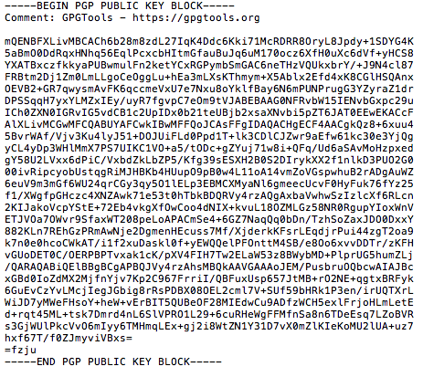
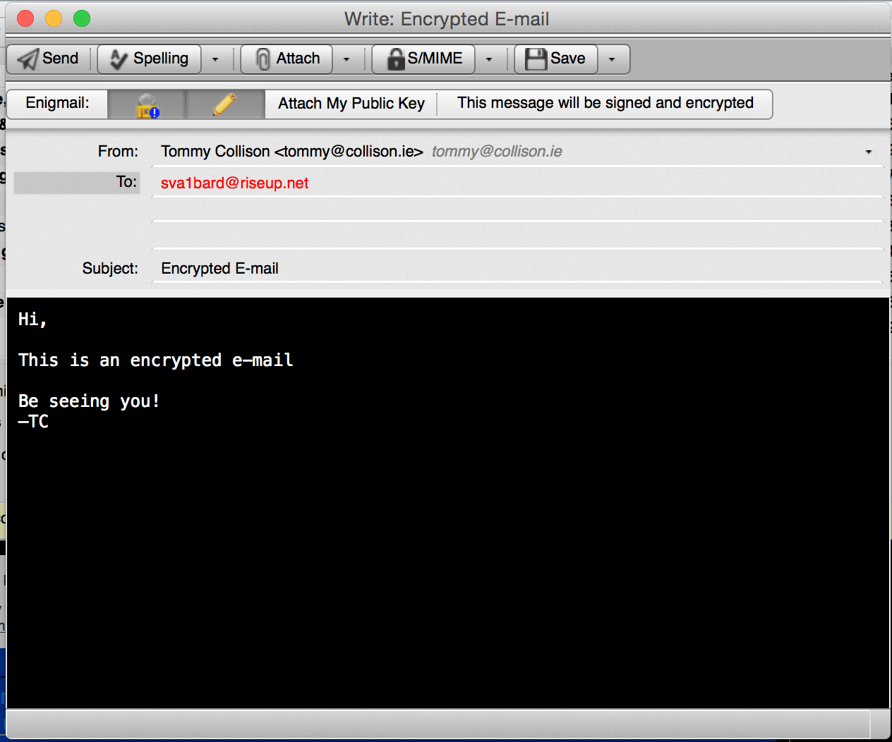
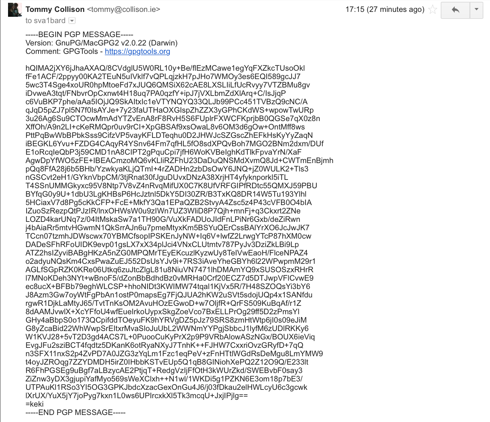
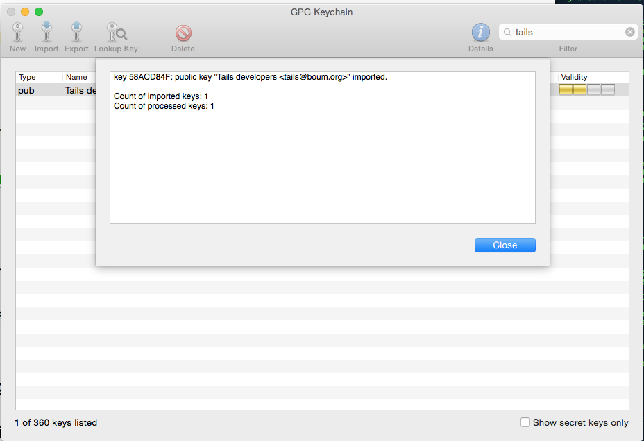
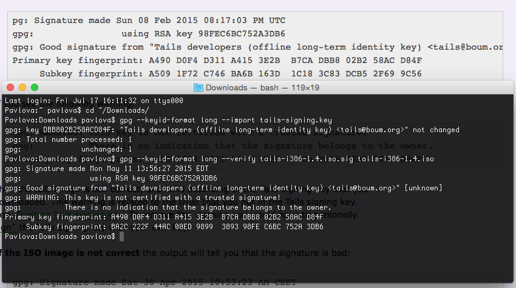

# Encryption Works: A Guide to Protecting Your Privacy for Journalists, Sources, and Everyone Else

Warning: This guide has not updated in over a year. Freedom of the Press Foundation is working on an updated version. If you're interested in contributing, or have ideas for what this guide should cover, please submit issues on <a href="https://github.com/freedomofpress/encryption-works">GitHub</a>

> *Encryption works. Properly implemented strong crypto systems are one of the few things that you can rely on. Unfortunately, endpoint security is so terrifically weak that NSA can frequently find ways around it.*
> 
> — Edward Snowden, answering questions live on the [Guardian's website](http://www.guardian.co.uk/world/2013/jun/17/edward-snowden-nsa-files-whistleblower)

The NSA is the biggest, best funded spy agency the world has ever seen. They spend billions upon billions of dollars each year doing everything they can to vacuum up the digital communications of most humans on this planet that have access to the Internet and the phone network. And as the recent reports in the Guardian and Washington Post show, even domestic American communications are not safe from their net.

Defending yourself against the NSA, or any other government intelligence agency, is not simple, and it's not something that can be solved just by downloading an app. But thanks to the dedicated work of civilian cryptographers and the free and open source software community, it's still possible to have privacy on the Internet, and the software to do it is freely available to everyone. This is especially important for journalists communicating with sources online.

## Threat Model

The NSA is a powerful adversary. If you are its direct target, you have to go to great lengths to communicate in private, and even if you're not, billions of innocent Internet users get caught in the NSA's dragnet too.

While the tools and advice in this paper are aimed at protecting your privacy from the NSA's collection methods, the same advice can be used to increase your computer security against any adversary. It's important to remember that other governments, including China and Russia, spend massive amounts of money of their own high-tech surveillance equipment and are known to specifically target journalists and sources. In the US, bad digital security can cost whistleblowers their freedom, but in other countries it can cost both journalists and sources their lives. A [recent example from Syria](http://www.cjr.org/feature/the_spy_who_came_in_from_the_c.php?page=all) illustrates how careless digital security can have tragic results.

But changing some basic software practices could award you a great deal of privacy, even if it doesn't keep you secure against targeted attacks by governments. This paper explores methods you can use in both cases.

## Crypto Systems

> *We discovered something. Our one hope against total domination. A hope that with courage, insight and solidarity we could use to resist. A strange property of the physical universe that we live in.*
> 
> *The universe believes in encryption.*
> 
> *It is easier to encrypt information than it is to decrypt it.*
> 
> — Julian Assange, in the introduction of Cypherpunks: Freedom and the Future of the Internet

Encryption is the process of taking a plaintext message and a randomly generated key and doing mathematical operations with the two until all that's left is a scrambled, ciphertext version of the message. Decryption is taking the ciphertext and the right key and doing more mathematical operations until the plaintext is recovered. This field is called cryptography, or crypto for short. A crypto algorithm, what mathematical operations to do and how to do them, is called a cipher.

To encrypt something you need the right key, and you need the right key to decrypt it too. If the crypto software is implemented properly, if the math is sound, and if the keys are secure, all of the combined computing power on Earth cannot break this encryption.

We build crypto systems that depend on problems in mathematics that we believe to be hard, such as the difficulty in factoring large numbers. Unless there are mathematical breakthroughs that make these problems easier—and the NSA is keeping them secret from the rest of the world—breaking crypto that relies on them for security is unfeasible.

The design of crypto systems and ciphers should be completely public. The only way to ensure that the cipher itself doesn't have a critical flaw is to publish how it works, to have many eyes scrutinizing it in detail, and to let it weather real-world attacks in the wild to work out the bugs. The inner workings of most crypto that we use on a daily basis, like [HTTPS](https://en.wikipedia.org/wiki/Https), the technology that makes it possible to safely type credit card numbers and passwords into website forms, is completely public. An attacker that knows every single detail about how the encryption works should still fail to break the encryption without possessing the key. Crypto that is proprietary, and its underlying code secret, cannot be trusted to be secure.

Here's an important question to ask when assessing if a service or app that uses encryption is secure: Is it possible for the service provider itself to circumvent the encryption? If so, you cannot trust the security of the service. Many services like [Skype](http://arstechnica.com/security/2013/05/think-your-skype-messages-get-end-to-end-encryption-think-again/) and [Hushmail](http://www.wired.com/threatlevel/2007/11/hushmail-to-war/) promise "end-to-end" encryption, but often times it still means that the services themselves have the keys to decrypt the product. True end-to-end encryption means that the service provider cannot look at your communications even if they wanted to.

Another important fact to know about encryption is that it's about much more than protecting the privacy of communications. It can be used to "digitally sign" messages in a way that proves that the message originated from the person you expected it to. It can be used to build digital currencies like Bitcoin, and it can be used to build anonymity networks like Tor.

Encryption can also be used to prevent people from installing iPhone apps that didn't come from the App Store, to prevent people from recording movies directly from Netflix, and to prevent people from installing Linux on a Windows 8 tablet. And it can also be used to prevent [man-in-the-middle](https://en.wikipedia.org/wiki/Man-in-the-middle_attack) (MITM) attackers from adding malware to otherwise legitimate software updates.

In short, encryption encompasses a whole host of uses, but here we are focused on how we can use it to securely and privately communicate.

## Software You Can Trust

When Snowden uses the term "endpoint security" he means the security of the computers on either end of the conversation that are doing the encrypting and the decrypting, as opposed to the security of the message when it’s in transit. If you send an encrypted email to a friend but you have a keylogger on your computer that's logging the entire message, as well as the passphrase that's protecting your encryption keys, your encryption isn't worth very much.

Since Freedom of the Press Foundation board members Glenn Greenwald and Laura Poitras broke the NSA dragnet surveillance stories, a lot more information about US spy agencies has been made public. Specifically, Bloomberg wrote about [voluntary information sharing programs between US companies and US spy agencies](http://www.bloomberg.com/news/2013-06-14/u-s-agencies-said-to-swap-data-with-thousands-of-firms.html).

So far the most shocking revelation about these information sharing programs is that Microsoft has a policy of giving information about vulnerabilities in its software to the US government before it releases security updates to the public. The article says:

> Microsoft Corp. (MSFT), the world's largest software company, provides intelligence agencies with information about bugs in its popular software before it publicly releases a fix, according to two people familiar with the process. That information can be used to protect government computers and to access the computers of terrorists or military foes.

This means that it's likely that NSA has been handed the keys to any computer running Windows, Office, Skype, or other Microsoft software. If you're running this software on your computer, it's likely that, with enough effort, the NSA could compromise your computer, and thus your encrypted communications, if you became a target.

We've also learned from the [New York Times](http://www.nytimes.com/2013/06/20/technology/silicon-valley-and-spy-agency-bound-by-strengthening-web.html?pagewanted=all&_r=1&) that Skype, software that outside the security community has long had a reputation of being a secure way to communicate, has been feeding private conversations to the US government for the last five years.

> Skype, the Internet-based calling service, began its own secret program, Project Chess, to explore the legal and technical issues in making Skype calls readily available to intelligence agencies and law enforcement officials, according to people briefed on the program who asked not to be named to avoid trouble with the intelligence agencies.
> 
> Project Chess, which has never been previously disclosed, was small, limited to fewer than a dozen people inside Skype, and was developed as the company had sometimes contentious talks with the government over legal issues, said one of the people briefed on the project. The project began about five years ago, before most of the company was sold by its parent, eBay, to outside investors in 2009. Microsoft acquired Skype in an $8.5 billion deal that was completed in October 2011.
> 
> A Skype executive denied last year in a blog post that recent changes in the way Skype operated were made at the behest of Microsoft to make snooping easier for law enforcement. It appears, however, that Skype figured out how to cooperate with the intelligence community before Microsoft took over the company, according to documents leaked by Edward J. Snowden, a former contractor for the N.S.A. One of the documents about the Prism program made public by Mr. Snowden says Skype joined Prism on Feb. 6, 2011.

Proprietary software, such as much of what's released by Microsoft, Apple, and Google, has another flaw. It's much more difficult for users to independently verify that secret backdoors don't exist at the clandestine demands of the surveillance state. Though recent reports have shown that many companies hand over an unknown amount of information in response to FISA requests, none have been shown to have direct backdoors into their systems.

There is other software that's more reliable in this regard. [Free and open source software](https://www.fsf.org/about/what-is-free-software) is not always user friendly and it's not always secure. However when it's developed in the open, with open bug trackers, open mailing lists, open governing structures, and open source code, it's much more difficult for these projects to have a policy of betraying their users like Microsoft has.

GNU/Linux is an operating system that's composed entirely of free and open source software. Examples of GNU/Linux distributions include [Ubuntu](http://www.ubuntu.com/), [Debian](http://www.debian.org/), and [Fedora Core](https://fedoraproject.org/). It's the most popular free software alternative to Windows and Mac OS X.

While free software projects still might include malicious code (see the [Underhanded C Contest](http://underhanded.xcott.com/)), the person writing the code needs to hide it cleverly and hope none of the other developers, or downstream GNU/Linux package maintainers who prepare and compile the source code of projects to include in their distributions, notice.

In the 1990s, when civilian cryptography was becoming popular and the US government was doing [everything](https://en.wikipedia.org/wiki/Phil_Zimmermann#Criminal_investigation) [they could](https://en.wikipedia.org/wiki/Clipper_chip) to prevent it, the "cypherpunk" movement was born. Many pieces of software intended to bring encryption to the people grew out of that movement.

> *Cypherpunks write code. We know that someone has to write software to defend privacy, and since we can't get privacy unless we all do, we're going to write it. We publish our code so that our fellow Cypherpunks may practice and play with it. Our code is free for all to use, worldwide. We don't much care if you don't approve of the software we write. We know that software can't be destroyed and that a widely dispersed system can't be shut down.*
> 
> — Eric Hughes, in his 1993 Cypherpunk Manifesto

That code, that's open and public so that fellow cypherpunks may practice and play with it, which anyone in the world can freely use, makes the basis of the software and protocols that we can trust: TLS (the encryption that powers HTTPS), LUKS ([disk encryption](https://en.wikipedia.org/wiki/Disk_encryption) built-in to GNU/Linux), OpenPGP, Off-the-Record, and Tor.

The [Tactical Technology Collective](https://tacticaltech.org/) has built a [great guide to open source security software that you can trust](https://tacticaltech.org/security-box) to keep your communications private from surveillance. It's important to remember that just using this software, and even using it perfectly, cannot guarantee the security of your crypto. For example, we have no idea if Apple has handed over [zero day](https://en.wikipedia.org/wiki/Zero-Day_Attack) vulnerabilities to the NSA for iOS like Microsoft is reported to have done. ChatSecure, which lets you have encrypted chat conversations on iOS devices, is only as secure as the operating system that it's running on.

It's important to remember that just because you use free software doesn't mean you can't get hacked. People find zero day exploits for free software all the time, and sometimes sell them to governments and other malicious attackers. Free software users still download malicious attachments in their email, and they still often have badly configured and easily exploited services on their computers. And even worse, malware is often very good at hiding. If a free software user gets malware on their computer, it might stay there until the user formats their hard drive.

Tails, which is a live DVD and live USB GNU/Linux distribution that I will discuss in detail below, solves many of these problems.

## Signal and TextSecure

>"Now we have free, easy-to-use tools which you can download on your smartphone, which is sitting in the room with you. For the iPhone, there's a program called Signal, by Open Whisper Systems. It's very good, I know the security model."
>
> — Edward Snowden on protecting communications in transit. ([Source](https://www.youtube.com/watch?t=149&v=j_kieJ-Ng2Q).)

Cryptography tools have been around since the early 90s, but the Snowden disclosures kickstarted a renewed interest in widespread consumer cryptography. In response to usability issues with PGP and the ubiquity of smartphones, several new apps providing end-to-end encryption have risen to prominence.

Chief among these is [Signal](https://whispersystems.org), a free and open-source application which employs end-to-end encryption, allowing users to have encrypted calls and text conversations. Signal is completely open source, and is made by [Open Whisper Systems](https://whispersystems.org).

You can download [Signal](https://itunes.apple.com/us/app/signal-private-messenger/id874139669) on iOS devices; on Android devices, the functionality for making encrypted calls and sending encrypted texts is split into two apps: [TextSecure](https://play.google.com/store/apps/details?id=org.thoughtcrime.securesms) and [RedPhone](https://play.google.com/store/apps/details?id=org.thoughtcrime.redphone). The Android apps are entirely cross-compatible with Signal.

As with OTR, both parties need to be using the app for the encryption to work. Signal uses your device's data connection (or wifi), and so users don't incur SMS fees.

Signal also makes it possible for you to verify the cryptographic identities of the people you communicate with. This is not possible in iMessage -- the key fingerprints are totally hidden from and inaccessible to the end user.

It's important to remember what these apps can and can't do -- while they will encrypt your conversations and log less metadata than traditional text messaging (the servers don't keep logs of who called who), you still have to use a valid cellphone number to sign up and, as always, beware of malware on your device.

### Doesn't Apple Provide End-To-End Encryption?

Apple made news when they [announced](https://www.apple.com/apples-commitment-to-customer-privacy/) that iMessage conversations were end-to-end encrypted, meaning that if Apple is served with a legal order, they could not decrypt your communications even if they wanted to.

>For example, conversations which take place over iMessage and FaceTime are protected by end-to-end encryption so no one but the sender and receiver can see or read them. Apple cannot decrypt that data.
>
> [What we’re most commonly asked for and how we respond.](http://www.apple.com/privacy/government-information-requests/) Apple.com

This was a big step, making iMessage more secure than traditional text messaging, and it's better than what most tech companies are putting out. But while both Signal and iMessage offer end-to-end encryption, there's an important distinction that makes Signal more secure.

The problem lies with proprietary software, which includes much of what’s released by Microsoft, Apple, and Google. It’s much more difficult for security researchers or users to independently verify that secret backdoors don’t exist at the clandestine demands of the surveillance state -- or that Apple doesn't secretly send a copy of your iMessages to the FBI.

In the impassioned open letter, Apple CEO Tim Cook affirmed Apple's commitment to privacy, and claimed that no Apple device has a backdoor which allows a government to access user data."

> “Finally, I want to be absolutely clear that we have never worked with any government agency from any country to create a backdoor in any of our products or services. We have also never allowed access to our servers. And we never will.”
>
> — ["A message from Tim Cook about Apple’s commitment to your privacy."](https://www.apple.com/privacy/) Apple.

While we commend his comments and praise Apple for implementing these encryption features on devices running iOS, users have no way to verify this technically. We’re forced to believe Cook because Apple uses proprietary (closed source) software.

Free and open-source software, on the other hand, is developed with open bug trackers, open mailing lists, open governing structures and open source code. This makes it much harder for the software to be compromised by an adversity without the knowledge of the users. Since Signal is open-source, it has a higher degree of trust in this regard than iMessage.

## Anonymize Your Location with Tor

While you can often be tracked when browsing the Internet by both private corporations and governments, it's still possible to use the web and avoid many types of mass surveillance. The easiest way is to use the Tor Browser, a web browser like Firefox or Safari. The Tor Browser allows you to browse the web while masking your IP address, which is generally a relatively accurate representation of your approximate location.

The software is free and open-source, meaning that it comes with a high degree of trust, and is an adapted version of the Firefox browser.

The Tor network is made up of over 6,000 volunteer servers, called nodes. When you use Tor, your connection is routed through three of these nodes — called a circuit – before exiting onto the normal Internet. Anyone intercepting Internet traffic will think your location is the final node which your traffic exits from.

The EFF has a good graphical explanation of how Tor works:

### Setup

The easiest way to start using Tor is to download and install the [Tor Browser Bundle](https://www.torproject.org/download/download-easy.html.en). Once you download and install it, you'll see that it works like any other web browser but is a little bit slower, since your traffic is being routed through the Tor network to provide you with anonymity.

Some countries, such as [China](https://blog.torproject.org/blog/torprojectorg-blocked-gfw-china-sooner-or-later) and [Iran](https://blog.torproject.org/blog/iran-blocks-tor-tor-releases-same-day-fix) block Tor because, by design, Tor exit nodes are public. It's possible to get around this by using what are known as [bridges](https://bridges.torproject.org/) -- unlisted relays which may be less likely to be blocked by ISPs and/or governments.

When Snowden [was answering questions on Guardian's website](http://www.guardian.co.uk/world/2013/jun/17/edward-snowden-nsa-files-whistleblower) from a "secure Internet connection", he was probably routing his traffic through the Tor network. He may have also been using a [bridge](https://bridges.torproject.org/) to connect to the Tor network to make the fact that he was using Tor from his IP address less obvious to eavesdroppers.

### Browsing Habits

Here are some further tips to enhance your security and privacy while using the Tor browser. Some tips, such as disabling flash, are good advice for any web browser.

- Use Tor's new [Security Slider](https://blog.torproject.org/blog/tor-browser-45-released) feature. This allows you some control over your Tor experience based on your threat model. Generally speaking, we recommend setting it to "Medium-High."
- Be careful of unencrypted sites, which don't have a lock icon next to the URL. Tor anonymizes your Internet traffic but unencrypted connections can still be eavesdropped on between the final node and the Internet server.
- Try to avoid downloading files such as PDFs or Microsoft Word
documents (which end in .doc or .docx), as they can be vehicles for malware that can be used by an attacker to de-anonymize your web browsing.

However, these limitations are designed to keep Tor as secure as possible. They can get in the way of your regular browsing habits, and so you should keep another web browser around (with add-ons such as [HTTPS Everywhere](https://www.eff.org/https-everywhere)) for other browsing.

### What Tor Doesn't Protect You From

It's important to remember that just because your connection to the Internet may be anonymous that doesn't magically make it secure. EFF has made a great [visualization of how Tor and HTTPS can work together to protect your privacy](https://www.eff.org/pages/tor-and-https).

There's been some discussion of global adversaries -- governments or other actors who can monitor the Internet on a huge scale -- de-anonymizing Tor traffic by large-scale surveillance. From [documentation](https://tails.boum.org/doc/about/warning/index.en.html#index7h1) for Tails:

> A global passive adversary would be a person or an entity able to monitor at the same time the traffic between all the computers in a network. By studying, for example, the timing and volume patterns of the different communications across the network, it would be statistically possible to identify Tor circuits and thus matching Tor users and destination servers.

We don't know if the NSA and GCHQ are big enough to fit this definition of "global adversaries," but we do know they monitor a large portion of the Internet. It's too early to say whether this large-scale surveillance is enough to defeat Tor's network anonymity in the general sense.

Thanks to the Snowden documents, we know that for many Internet users, powerful intelligence agencies such as NSA, GCHQ, and the collective "5 Eyes" fit this definition of a global passive adversary. It remains unclear whether they can use their network perspective to reliably de-anonymize Tor users, though.

According to leaked NSA slides with titles such as ["Tor Stinks"](http://www.theguardian.com/world/interactive/2013/oct/04/tor-stinks-nsa-presentation-document), Tor is "still the King of high secure, low latency Internet Anonymity" with "no contenders." However, the same slides also indicate that the surveillance agency can de-anonymize "a very small fraction" of Tor users. Also important to note is that these slides are also several years old now, so we don't know what the current status of these powerful organization's capabilities might be.

Such an attack attack like this becomes much harder as the number of nodes and the volume of traffic increases -- not impossible, but more time-consuming and expensive. Everyone can pitch in and bolster the Tor network by setting up a node; since colleges and universities are often their own ISP with strong infrastructure, students and staff are particularly [encouraged](https://www.eff.org/torchallenge/tor-on-campus.html) to set up a Tor node on campus.

Recently, the Tor Project [commented](https://blog.torproject.org/blog/preliminary-analysis-hacking-teams-slides) on reports that Hacking Team, the surveillance technology vendor which was massively hacked in July 2015, had managed to compromise the Tor network. The attack turned out to be a case of targeted surveillance rather than a widespread problem:

> The good news is that they don't appear to have any exploit on Tor or on Tor Browser. The other good news is that their proposed attack doesn't scale well. They need to put malicious hardware on the local network of their target user, which requires choosing their target, locating her, and then arranging for the hardware to arrive in the right place. So it's not really practical to launch the attack on many Tor users at once.

You also have to be careful *where* you use Tor, since it could actually leave you *more* exposed in some instances, even though your traffic is encrypted. That's because network admins can tell when someone is using Tor, even though they can't tell what websites you're browsing.

In December 2013, several members of the Harvard University administration [received](http://www.theverge.com/2013/12/18/5224130/fbi-agents-tracked-harvard-bomb-threats-across-tor) a bomb threat sent from a burner email address. The FBI and Harvard officials were able to trace the email back to a student who had sent the threat to avoid taking a final exam. The student had used an anonymous email with the Tor browser, but still got caught because he used Tor from the Harvard network -- administrators were able to tell he was one of the few people using Tor that morning and confronted him.

It's hard to have much sympathy for the prankster, but the fact that users can sometimes be de-anonymized is worrying for the many human rights activists and journalists who depend on Tor. This is why prominent security researcher Bruce Schneier [talks about]((https://www.schneier.com/blog/archives/2015/06/why_we_encrypt.html)) using encryption to provide "cover" for others who use encryption to save their lives.

As with all privacy-enhancing software, an attacker with physical access to the device can compromise you in any number of ways.

With all this said, using Tor still gives us many advantages. It makes the job of the global adversary much harder, and we leave much less identifying data on the servers we connect to through the Tor network. It makes it much harder to be the victim of a man-in-the-middle attack at our local network or ISP level. Even if some Tor circuits can be defeated by a global adversary, if enough people are getting their traffic routed through the same Tor nodes at the same time, it might be difficult for the adversary to tell which traffic belongs to which circuits.

## Off-the-Record (OTR) Chat

The best way to end-to-end encrypt your instant messages is to use something called OTR chat with a Jabber/XMPP account. While it's possible to use OTR with Google Talk or Facebook Chat, we don't recommend it because these services could drop support for OTR without warning. Plus, Jabber leaks less metadata than these services, especially if both people are using the same Jabber server.

### How To Use

To use OTR, you'll need to download additional software with your IM client. If you use Windows you can download and install [Pidgin](https://pidgin.im/) and the [OTR plugin](http://www.cypherpunks.ca/otr/). If you use Mac OS X you can download and install [Adium](https://adium.im), a free software chat application that includes OTR support. If you use GNU/Linux you can install the pidgin and pidgin-otr packages.

There are also OTR clients available for Android phones, called [Gibberbot](https://play.google.com/store/apps/details?id=info.guardianproject.otr.app.im), and for iOS, called [ChatSecure](http://chrisballinger.info/apps/chatsecure/).

For a full explanation of how it works and how to set it up, check out the Intercept's guide to [chatting in secret while we're all being watched](https://firstlook.org/theintercept/2015/07/14/communicating-secret-watched/). As an added bonus, the Intercept also explains how to set up OTR to work with Tor so you can keep your chats both anonymous and encrypted.

Like PGP, OTR is used for two things: **encrypting the contents** of real-time instant message conversations and **verifying the identity** of people you chat with. Identity verification is important, and something many OTR users neglect to do. While OTR is more user-friendly than other types of encryption, there are some things you should know about OTR to understand it fully and know what attacks against it are possible.

OTR encrypts the contents of your chats but not the metadata related to them -- who you talk to, how often, and when. You can use Google Talk and Facebook Chat with OTR, but we know that these services comply with surveillance requests from many governments that leave your metadata exposed, even if you're encrypting the content of your IM conversations. This is another reason to use XMPP, since it supports sending data over the Tor network, adding an additional layer of protection from metadata analysis.

For this reason, Freedom of the Press Foundation recommends using a chat service that doesn't collaborate with intelligence agencies, such as Jabber. It's not a guarantee against metadata gathering, but it's better than nothing. OTR works with Google Talk and Facebook Chat, but Freedom of the Press Foundation recommend using XMPP, also known as Jabber. Jabber is an open protocol, and, unlike Facebook and Google, makes it harder for conversation metadata to be found. This is good for journalists who want to speak more securely to whistleblowers.

Jabber servers you can get free accounts with include [Calyx Institute](https://www.calyxinstitute.org/projects/public_jabber_xmpp_server), [Riseup](https://help.riseup.net/en/chat) and [Duck Duck Go](https://duck.co/blog/post/4/xmpp-services-at-duckduckgo).

### Keys

When you start using OTR, your chat client generates an encryption key and stores it in a file on your hard drive. If your computer or smartphone gets lost, stolen, or infected with malware, you should assume your key has been compromised -- an attacker could impersonate you. If this happens, you should generate a new key and reverify yourself with your chat clients.

When you start a new OTR session, your OTR software and your friend's OTR software send a series of messages back and forth to agree upon a new session key. This temporary encryption key, which is only known by your IM clients and is never sent over the Internet, is then used to encrypt and decrypt messages. When the session is finished both clients forget the key. If you start chatting with the same person later, your clients generate a brand new session key.

In this way, even if an eavesdropper is logging all of your encrypted OTR conversations -- which NSA believes it is legally [allowed to do](http://www.forbes.com/sites/andygreenberg/2013/06/20/leaked-nsa-doc-says-it-can-collect-and-keep-your-encrypted-data-as-long-as-it-takes-to-crack-it/) in many cases, even if you're a US citizen and they don't have a warrant or probable cause -- and later they compromise your OTR key, they cannot use it to go back and decrypt your old conversations.

This property is called forward secrecy, and it is a feature that OTR has which PGP does not. If your PGP secret key (more on this below) gets compromised, and the attacker has access to all the encrypted messages you've received, they can go back and decrypt them all.

### A Note About Gmail's "off the record" function.

When using Google Talk for instant messaging, there's a setting to "Go off the record," and it's useful to differentiate between this feature and what the Off-The-Record encryption software offers.

 

Essentially, going off the record in Google Talk (or disabling the "Hangout history" function, if you've updated to Hangouts) does not store the conversation log in either conversation participant's Gmail chat history. This may seem more secure, but it only prevents the conversation participants from viewing the history of their own conversations. There is no guarantee or way of determining whether or not Google retains a copy of your conversation.

By comparison, conversations over Google Talk which use Off-The Record message encryption are only readable to the participants, and Google is never able to read the contents of your conversation. This is far more secure.

### Verifying A Contact's OTR Fingerprint

If you want to use OTR to talk privately with friends, colleagues, and sources, they need to be using OTR too. An encrypted chat requires both people have keys, so if you're using OTR and you're chatting with a colleague who's using facebook.com, you cannot have an encrypted conversation.

When you start an encrypted OTR session, your chat software will tell you something like this:

> *** Encrypted OTR chat initiated. tommyc@jabber.ccc.de's identity not verified.

With OTR, each key has a fingerprint, a string of numbers and letters you can use to verify someone's identity. Mine is AF4E5D5A D8AE95CB C1672DDC E44FA6F4 F8706C16. Unlike session keys, encryption keys are persistent: the fingerprint will stay the same across numerous conversations unless you change device or are the victim of a man-in-the-middle attack.

It's worth remembering that fingerprints are unique to devices, not accounts. This means that if I chat with people on my Jabber account from my Mac and from my Android phone, those contacts will have two fingerprints for me.  It's important to repeat the verification step on each device with each contact you talk to.

In the screenshot above, you can see the OTR fingerprints for both users in the session. The other person should see the exact same fingerprints. In order to be sure that both parties are seeing the correct fingerprints you both need to find some other secure channel to verify fingerprints. You could meet up in person, or talk on the phone if you can recognize their voice, or send a PGP encrypted and signed email.

OTR fingerprints are 40 characters. It's statistically impossible to generate two OTR keys that have the same fingerprint. However, it is possible to generate an OTR key that isn't a collision but looks like one on cursory inspection. For example, the first few characters and last few characters could be the same with different characters in the middle. For this reason, it's important to compare each of the 40 characters to be sure you have the correct OTR key.

Without verifying keys you have no way to know that you're not falling victim to an undetected, successful MITM attack. Even if the person you're talking to is definitely your real friend because she know things that only she would know, and you're using OTR encryption, an attacker might still be reading your conversation. This is because you might actually be having an encrypted OTR conversation with the attacker, who is then having a separate encrypted OTR conversation with your real friend and just forwarding messages back and forth. Rather than your friend's fingerprint your client would be seeing the attacker's fingerprint. All you, as a user, can see is that the conversation is "Unverified".

That said, it's better to use OTR unverified than it is to have a sensitive conversation through an unencrypted channel. Although manual fingerprint verification is the most secure way of verifying a chat partner's identity, there are some on-the-fly methods: you could ask them for a detail only they would know -- **what color is the sofa in my apartment?** or **what dish did you bring to the pot-luck last week?**

This approach wouldn't have worked when Edward Snowden first made contact with Laura Poitras, though. For this reason, Poitras asked someone both she and Snowden were in contact with to tweet Poitras's fingerprint, which provided external verification of the key.

### Logs

OTR will encrypt the content of your chats, but there's another factor to consider when you're chatting with Off-The Record: logs.

Here is an excerpt from the chat logs of a conversation between Chelsea Manning (shown here as bradass87) and Adrian Lamo, who turned him in to authorities. They were [published](http://www.wired.com/threatlevel/2011/07/manning-lamo-logs) by Wired.

> (1:40:51 PM) bradass87 has not been authenticated yet. You should authenticate this buddy.

> (1:40:51 PM) Unverified conversation with bradass87 started.

> (1:41:12 PM) bradass87: hi

> (1:44:04 PM) bradass87: how are you?

> (1:47:01 PM) bradass87: im an army intelligence analyst, deployed to eastern baghdad, pending discharge for "adjustment disorder" in lieu of "gender identity disorder"

> (1:56:24 PM) bradass87: im sure you're pretty busy...

> (1:58:31 PM) bradass87: if you had unprecedented access to classified networks 14 hours a day 7 days a week for 8+ months, what would you do?

As you can see from "Unverified conversation with bradass87 started," they were using OTR to encrypt their conversation, but excerpts were published on Wired's website and used as evidence in Manning's trail. The reason why? Because either Manning and Lamo's OTR clients were logging a copy of their conversations and saving the chat to a hard drive, unencrypted.

For journalists, logging conversations (either by taking notes or using a tape recorder) is part of the job, but you should know that logging conversations greatly compromises your privacy. If the clients hadn't logged OTR conversations by default, it's likely that the above conversation would never have become part of the public record.

With the release of OTR 4.0 in September 2012, Pidgin stopped logging OTR conversations by default. As of July 2015, Adium still logs OTR conversations by default, and you must manually turn off logging yourself in Adium's Preferences pane.

We recommend turning off logging by default and saving individual conversations only when necessary.

## "Pretty Good Privacy" (PGP) Email Encryption

In 1991, cryptographer Phil Zimmermann developed [Pretty Good Privacy](https://en.wikipedia.org/wiki/Pretty_Good_Privacy) (PGP), software that he intended for peace activists to use while organizing in the anti-nuclear movement.

PGP stands for "Pretty Good Privacy," software you can use to encrypt your e-mail messages. Today, PGP is a company that sells proprietary encryption software. [OpenPGP](http://openpgp.org/) is the open protocol that defines how PGP encryption works, and [GnuPG](http://www.gnupg.org/) (GPG for short) is free software, and is totally compatible with the proprietary version. GPG is much more popular than PGP today because it's free for everyone to download, and cypherpunks trust it more because it's open source. The terms PGP and GPG are often used interchangably.

Unfortunately, the process is notoriously hard to use, as evidenced by Glenn Greenwald initially being [unable](http://www.huffingtonpost.com/2013/06/10/edward-snowden-glenn-greenwald_n_3416978.html?1370895818) to set it up and talk security with Edward Snowden. However, as Snowden says in the documentary _CitizenFour_:

> You want to get in the process of doing this for everything because it seems hard, but it's not hard... this is super easy.

If you use PGP encryption, you will have to make a few changes about how you use e-mail. For example, if you use PGP on your computer but receive an encrypted e-mail on your phone, you won't be able to decrypt the e-mail and read it until you get back to your computer.

PGP is used in two ways with e-mail: 

1) A sender can encrypt the content of e-mail messages so that only the sender and receiver can read them.

2) Senders can sign messages, proving that the message the sender sent is the same one the receiver reads, and that it wasn't tampered with in transit. (Assuming you trust the public key -- more on this later.)

On the other end, the receiver uses PGP to decrypt the message and verify the e-mail's digital signature.

### What's a key?

PGP uses a public key and a private key, two mathematically-related numbers which are represented as unique strings of randomly-generated numbers and letters. Information about the public key is stored on something called a public key server, which is a bit like a phonebook. When people want to e-mail you securely, they can look up your public key and send you an encrypted e-mail.

Like OTR, each PGP key has a unique fingerprint. [Here's](https://pgp.mit.edu/pks/lookup?op=get&search=0xE7E8E7D097604F9D) the PGP public for Tommy Collison, one of the editors of this guide. That key's fingerprint is 696E C53E 8535 6DE8 10C3 75D2 E7E8 E7D0 9760 4F9D. Look at the PGP block above -- it's long and would be difficult to verbally confirm with another person. A fingerprint is a short and more convenient way to uniquely represent a key.

You can think of your public key and private key like your e-mail address and e-mail passphrase. You probably want your general e-mail address to be public, so that people can contact you -- it's the same with your public key. And, in the same way you should always keep your e-mail passphrase to yourself, you should never share your private key with anyone or attach it in an e-mail.

It's a good idea to publicize your public key, to help people who want to contact you verify that the public key they use belongs to you. Many people [tweet](https://twitter.com/tommycollison/status/620696207187398656) their key's fingerprint, [mention](http://parkerhiggins.net/2014/08/email-signature-nudge-encryption-use/) it in their email signatures, or [link](https://twitter.com/ggreenwald) to it in their Twitter bio:

This increases the legitimacy of the key. Not only does an attacker have to create a false key for Greenwald, but they have to hack his Twitter account and point the link in his bio to his key to the fake key. That's not likely to happen, especially since —for added security— Glenn's public key is listed on his site, [firstlook.org/theintercept](https://firstlook.org/theintercept). This line of attack leaves several obvious clues, and so it's hard to pull off. Therefore, we can say with some degree of trust that Glenn's public key info is legitimate.

### Software

To install GPG, Windows users can install [Gpg4win](http://www.gpg4win.org) and Mac OS X users can download [GPGTools](https://gpgtools.org). If you run GNU/Linux you should already have GPG installed (since GPG is a command line program) but there's software that interfaces with email clients that makes it much easier to use.

To use GPG securely, you have to download and use a desktop mail client rather than log into your email through a browser. Freedom of the Press Foundation recommends using [Thunderbird](https://www.mozilla.org/en-US/thunderbird) as your desktop e-mail client with the [Enigmail](https://www.enigmail.net/home/index.php) add-on for GPG. 

While some third parties have developed end-to-end encryption plugins that you can use with browser mail, we don't recommend them because they're comparatively less secure than desktop client-based GPG and don't have all the features.

### Sending And Receiving Encrypted E-mail

Once you've installed Enigmail, you'll notice some new settings when you go to compose an e-mail in Thunderbird.

When sent, only *sva1bard@risup.net's* private key will be able to decrypt this e-mail (since it's encrypted with the corresponding public key).

If you try and access an encrypted e-mail in a web browser, it's unreadable because the private key is missing. 

But when the e-mail is accessed with the correct private key, it becomes readable again:

## Encrypting Files with PGP

As well as powering e-mail encryption with a desktop client like Apple Mail or Thunderbird, you can also use PGP to encrypt files on your hard-drive with your public key.

This serves as a second layer of protection if you use full-disk encryption and lends you extra security to transfer those files onto a flash drive or upload them to a cloud storage website.

### The Web of Trust

PGP works best when a web of trust is created. Strong crypto can't be broken, but can still be circumvented since humans are the weakest elements of any security system. People using PGP can fall victim to what's called a "man in the middle attack." Let's say you're talking to your colleague via encrypted e-mail and I'm an attacker. I could trick you into thinking that my public key was your colleague's. You'd encrypt a message with your private key and my public key. I can decrypt it, read and/or tamper with it, and then send the compromised message onto your colleague, with info purported to be from you.

This can be solved, or at least mitigated, if you and your colleague independently verify each other's keys. This way, you verify your colleague's public key independently of when they e-mail you. But this raises another problem -- meeting people and verifying their keys is time-consuming.

One answer to this is the web of trust. As time goes on, you meet people and verify their keys. If you sign those keys (publicly asserting that you've verified them), that functions as a vouch of sorts -- this key has verified that key belongs to who it says it does. If I trust your key, by extension I should trust the keys you've signed, even if I don't know the signed key personally. I trust it because I trust you.

Micah Lee, an FPF technologist, helped Snowden get in contact with Laura Poitras. In an essay for The Intercept, he [references](https://firstlook.org/theintercept/2014/10/28/smuggling-snowden-secrets/) the usefulness of the web of trust and external verification:

> My encryption key was posted at both sites, so Snowden was able to find it easily, and the key was digitally signed by people who were well-known in the privacy world (pioneering blogger Cory Doctorow and free software champion Richard Stallman, for instance); this meant those people had digitally vouched, in a way that was incredibly difficult to forge, that the key really belonged to me and not to, say, some NSA trickster. In other words, Snowden didn’t need to worry about the key being a fake. Poitras was a founding board member of the FPF, so he assumed I would have her key, and he was right.

There are some times when you won't want someone to sign your key, since doing so implies a relationship between the two keys and, by extension, the two people. There are times that you don't always want to reveal that -- the source-journalist relationship comes to mind.

On the other hand, signatures lend trustworthiness -- if I were a whistleblower looking for Glenn Greenwald's correct key, I'd trust the one signed by his colleagues more than any other ones.

(When you create a PGP key, there's no verification process that you the e-mail address associated with the key, so signing keys is a way of proving ownership. This has happened to several Tor developers and one of the editors of this guide.)

In general, it's good to be cautious about signing keys. It's worth weighing the pros and cons of signing and deciding on a case-by-case basis.

### How To Verify Someone's Key in Enigmail and View Signatures

If you're a journalist trying to get to grips with these privacy tools, it's useful to get together with colleagues and help one another out with setup. In addition, you can increase the trustworthiness of a colleague's key by signing it. In essence, you're publicly asserting that you trust that a person's key belongs to that person, and wasn't created by someone else.

Here's how to verify someone's GPG key:

- Meet your colleagues face-to-face. Each person should bring their own laptop.
- Make sure your key is uploaded to a key-server. In the "Key Management" section of Enigmail, right-click and select "Upload Public Keys to Keyserver." It should suggest [pgp.mit.edu](http://pgp.mit.edu) by default, which will work fine.
- Search for your friend's key in the keyserver and download it into Enigmail. Then, verbally verify that the fingerprints are the same. If you know your colleagues, this is enough, but if you're unsure of names, feel free to ask people to bring some form of ID so you can double-check.
- Once you've verified their key is correct, you should sign it with yours.
- You can see who else has signed a person's key by clicking on it and choosing "View Signatures" from the "Select action ..." drop-down menu.
- In the end, each person should have an GPG keyring containing signed keys of each other person.

### PGP Isn't Just For Email

While PGP is often used for email encryption, nothing stops you from using it to encrypt anything and publish it using any medium. You can post PGP encrypted messages on blogs, social networks, and forums.

For example, Wired journalist Kevin Poulsen [published a PGP encrypted message on Wired's website](http://www.wired.com/threatlevel/2013/06/signed-bda0df3c/) intended for Edward Snowden to read the same week his name was made public. Snowden's alleged public key was [published](http://pgp.mit.edu/pks/lookup?search=edward+snowden) on a keyserver under a Hushmail email address.

As long as Wired has a copy of Snowden's real public key, only someone in possession of Snowden's secret key can decrypt this message.

Here's a message that was encrypted to Micah Lee's public key. Without having access to his associated private key, NSA should not be able to break the encryption. (NSA -- let us know if you get it.)

    -----BEGIN PGP MESSAGE-----
    Version: GnuPG v1.4.12 (GNU/Linux)

    hQIMA86M3VXog5+ZAQ//Wep9ZiiCMSmLk/Pt54d2wQk07fjxI4c1rw+jfkKQAi4n
    6HzrX9YIbgTukuv/0Bjl+yp3qcm22n6B/mk+P/3Cbxo+bW3gsq5OLFNenQO3RMNM
    i9RC+qJ82sgPXX6i9V/KszNxAyfegbMseoW9FcFwViD14giBQwA7NDw3ICm89PTj
    y+YBMA50iRqdErmACz0fHfA/Ed5yu5cOVVa8DD12/upTzx7i0mmkAxwsKiktEaKQ
    vg8i1gvzqeymWYnckGony08eCCIZFc78CeuhODy0+MXyrnBRP9p++fcQE7/GspKo
    SbxVT3evwT2UkebezQT2+AL57NEnRsJzsgQM4R0sMgvZI7I6kfWKerhFMt3imSt1
    QGphXmKZPRvKqib59U57GsZU1/2CMIlYBVMTZIpYKRh6NgE8ityaa4gehJDl16xa
    pZ8z3DMNt3CRF8hqWmJNUfDwUvXBEk8d/8Lkh39/IFHbWqNJh6cgq3+CipXH5HjL
    iVh7tzGPfB6yn+RETzcZjesZHtz4hFudOxTMV0YnTIv0FGtfxsfEQe7ZVmmfqGNG
    glxE0EfbXt0psLXngFMneZYBJqXGFsK3r5bHjRm6wpC9EDAzXp+Tb+jQgs8t5eWV
    xiQdBpNZnjnGiIOASOxJrIRuzbTjo389683NfLvPRY8eX1iEw58ebjLvDhvDZ2jS
    pwGuWuJ/8QNZou1RfU5QL0M0SEe3ACm4wP5zfUGnW8o1vKY9rK5/9evIiA/DMAJ+
    gF20Y6WzGg4llG9qCAnBkc3GgC7K1zkXU5N1VD50Y0qLoNsKy6eengXvmiL5EkFK
    RnLtP45kD2rn6iZq3/Pnj1IfPonsdaNttb+2fhpFWa/r1sUyYadWeHs72vH83MgB
    I6h3Ae9ilF5tYLs2m6u8rKFM8zZhixSh
    =a8FR
    -----END PGP MESSAGE-----

### Attacks

If you don't verify identities you have no way of knowing whether or not you are the victim of a MITM attack.

Washington Post journalist Barton Gellman, who Edward Snowden trusted with information about the NSA's PRISM program, [wrote about his experience using PGP](http://www.washingtonpost.com/world/national-security/code-name-verax-snowden-in-exchanges-with-post-reporter-made-clear-he-knew-risks/2013/06/09/c9a25b54-d14c-11e2-9f1a-1a7cdee20287_story.html).

> On Thursday, before The Post published its first story, I made contact on a new channel. He was not expecting me there and responded in alarm.
> 
> "Do I know you?" he wrote.
> 
> I sent him a note on another channel to verify my digital "fingerprint," a precaution we had been using for some time. Tired, I sent the wrong one. "That is not at all the right fingerprint," he wrote, preparing to sign off. "You're getting MITM'd." He was talking about a "man in the middle" attack, a standard NSA technique to bypass encryption. I hastily corrected my error.

Snowden was right to be cautious and to insist that he check Gellman's new PGP fingerprint. PGP, if used right, provides the tools necessary to prevent MITM attacks. But these tools only work if users are vigilant about identity verification.

### What PGP Doesn't Do

To use PGP effectively, it's good to understand what it does and doesn't do.

For instance, using PGP with e-mail encryption only encrypts the *content* of your e-mails. It doesn't encrypt the to/from fields, the subject line or the metadata, the sundry details associated with the message. For an e-mail, metadata would include the associated e-mail addresses, the time and date sent and the IP address the e-mail originated from. This means that someone surveilling me can tell that at 2:05pm on Sunday, June 21, *tommy@freedom.press* e-mailed *trevor@freedom.press* from a certain IP address, but they can't tell what the content of the message was.

Senator Diane Feinstein (D—Calif.) is a staunch defender of the NSA and has long [maintained](http://www.theguardian.com/world/2013/oct/21/dianne-feinstein-defends-nsa-data-collection) that the type of metadata collection the NSA carries out isn't intrusive because it doesn't include the content. However, even the list of people you're in e-mail correspondence with can be very revealing. In May 2013, the Associated Press [reported](http://bigstory.ap.org/article/govt-obtains-wide-ap-phone-records-probe) that the Justice Department had seized email and phone records of the AP newsroom as part of their [investigation](http://www.vanityfair.com/news/2015/03/james-risen-anonymous-source-government-battle) of government leaks. Even if the reporters had been using PGP, this wouldn't have encrypted the email addresses the reporters were in contact with.

EFF [lists](https://www.eff.org/deeplinks/2013/06/why-metadata-matters) the numerous ways metadata can reveal more about someone than even the content of the calls. This is corroborated by former General Counsel of the National Security Agency Stewart Baker, who [said](http://www.rt.com/usa/158460-cia-director-metadata-kill-people/) that "Metadata absolutely tells you everything about somebody’s life. If you have enough metadata, you don’t really need content." Chillingly, former NSA director Michael Hayden has publicly [asserted](http://www.rt.com/usa/158460-cia-director-metadata-kill-people/) that "We kill people based on metadata." 

Many PGP users mitigate this metadata leakage by using purposefully unspecific email subject lines, such as "Summer 2015" or "cat pics," or leaving the field blank.

PGP also doesn't automatically guarantee anonymity. If I send a PGP-encrypted email from *tommy.collison@gmail.com,* it isn't hard to tell who the owner of the email address is, even though the content of the email is encrypted. For added security, combine PGP with a pseudonymous email account.

There are two other steps you can take to decrease the amount of metadata leaked when using PGP e-mail encryption. The first is [TorBirdy](https://trac.torproject.org/projects/tor/wiki/torbirdy), an extension for Thunderbird that routes the app's traffic through the Tor network, enhancing your privacy. It's an involved process, but worth a look if you're comfortable with advanced settings.

The second is using `--hidden-recipient` as a modifier to the `gpg` command when using GPG on the command-line. When the metadata of the subsequent encrypted file is [analyzed](http://tech.michaelaltfield.net/2013/10/19/analyzing-pgp-content/), the key ID of the recipient reads **0x0000000000000000**. 

### Verifying Checksums

Another use for PGP is to verify correct software. To understand what I mean, consider the question: when you go to download a piece of software (the Tor Browser Bundle, for example), how do you know that what you're downloading is the same as what the developers created? How do you know that you didn't download a fake version? This could happen accidentally or maliciously.

The answer is to check the "checksum" of the software. This is a string of between 32 and 64 characters which are unique to the piece of software you want to download. The string is shown in two places, on your computer and on the servers where you download the software from. Using the GPG tools installed on your computer, you can determine whether the string you see matches the one published on the developer's website. If the strings are the same, we can say with some degree of certainty that the file we downloaded is the same as the one the developer intended us to get.

For this example, let's verify the checksum of Tails, the operating system used by Greenwald, Poitras and Snowden which I go into detail about in a later chapter. 

To verify a checksum, you need to import the GPG public key of the Tails developers. To do this, download the Tails signing key from the [Tails website](https://tails.boum.org/download/index.en.html):

This will download the .key file onto your hard-drive. From there, you just need to drag and drop (or click **File > Import** in the GPG Keychain application):

From here, follow the advice on the [Tails installation page](https://tails.boum.org/download/index.en.html) on using the command line to verify the checksum.

Here, we can see my command line reads "Good signature," which means the software I downloaded was what the developers intended me to get. (In this example, I haven't verified the Tails signing key, which you should -- check out the Tails [website](https://tails.boum.org/doc/get/trusting_tails_signing_key/index.en.html) to learn how to do this.) 

In general, software websites have to provide the checksum for you to check, but not all do. Both [Tor](https://www.torproject.org/docs/verifying-signatures.html.en) and [Tails](https://tails.boum.org/download/index.en.html) give information on how to verify a checksum.

## Tails: The Amnesic Incognito Live System

As mentioned above, the Tor network is the best choice today for secure web browsing: it obscures your location, prevents third-party trackers, and you can create a new browsing identity quickly and easily. What if there was an entire operating system designed with these principles in mind?

That's the thinking behind the Tails system. PGP and OTR are totally undermined if an attacker has physically compromised your machine and, say, installed a keylogger to capture all your logins, passphrases, and other sensitive data.

Tails was designed to be an entire operating system comprised solely of "software you can trust," meaning that you don't have to rely on other closed-source software. It also has features to prevent tracking, such as wiping itself clean every time you power down.

> Tails is a live system that aims at preserving your privacy and anonymity. It helps you to use the Internet anonymously almost anywhere you go and on any computer but leave no trace using unless you ask it explicitly.
>
> It is a complete operating-system designed to be used from a DVD or a USB stick independently of the computer's original operating system. It is Free Software and based on Debian GNU/Linux.
>
> Tails comes with several built-in applications pre-configured with security in mind: web browser, instant messaging client, email client, office suite, image and sound editor, etc.

In some ways, Tails is more difficult to use compared to a regular operating system. It's slow, and doesn't have all the software you might need. But some of these shortcomings are by design: such limitations make it a lot harder to mess up their endpoint security. If you're in the position where you think the NSA, or another potential attacker, may want to target you or your colleagues (the journalist-whistleblower relationship comes to mind), it's the best tool available.

Since Tails isn't a practical choice for daily computer use, setting up Tor, PGP, and OTR encryption on your main operating system is also a good idea. 

Every time you boot Tails you start from a clean state. Anything and everything you did previously gets erased and the system reverts back to its default out-of-the-box state. It's designed this way so that if you get infected with malware while using Tails, it's almost certainly gone the next time you boot up.

(While Tails prevents many endpoint attacks, like all security tools, it is not 100% impervious to attacks. Recently, researchers have showed how attackers can implant malware in the BIOS —or the brains— of a computer, which may allow Tails to be [compromised](http://www.wired.com/2015/03/researchers-uncover-way-hack-bios-undermine-secure-operating-systems/). However, it's unclear how widespread this attack is or if it's particularly effective in the wild.)

It's a good idea to install Tails on a fresh storage device (either a DVD or a USB stick) to ensure everything works as it should. There are two ways of installing Tails:

- 1) Using the command line and the Tails .iso file to create a Tails instance on a removable storage device. For instructions, [click here](https://tails.boum.org/download/index.en.html).
- 2) Using an existing Tails installation and cloning the operating system onto a second storage device. For instructions, [click here](https://tails.boum.org/doc/first_steps/installation/index.en.html).

Once you get past this tricky install, Tails is currently the gold standard for anonymously using a computer, particularly when coupled with PGP-encrypted email.

**The email application bundled with Tails is called Claws Mail. Currently, there is a [serious vulnerability](https://tails.boum.org/support/known_issues/index.en.html#index21h2) in Claws Mail that can leak the plaintext of your emails to the email server. If you decide to use Claws Mail, we strongly recommend implementing one of the [official workarounds](https://tails.boum.org/security/claws_mail_leaks_plaintext_to_imap/index.en.html#index1h1) until the issue is fixed in Tails.**

### Persistence: How to save your work between sessions

Journalists rely on their notes, and so the idea of an operating system that saves nothing between sessions may sound sub-optimal. But Tails has the optional feature of persistence -- saving files in an encrypted volume which are accessible across separate sessions. This is useful for files you're working on, and encryption keys you use with Tails. (It's generally inadvisable to move keys off a Tails machine -- you should keep them compartmentalized and away from your regular computer operating system.)

If you're going to be using the persistence feature, you have to install Tails on a USB stick or an SD card, not a DVD. Also, you have to clone Tails from an existing installation rather than manually flashing Tails onto a USB from a computer.

The Tails [installation guide](https://tails.boum.org/doc/first_steps/persistence/configure/index.en.html) has instructions on configuring persistence.

### Setting Up Secure Computers 

> “Tails have been vital to my ability to work securely on the NSA story. The more I've come to learn about communications security, the more central Tails has become to my approach.”
> 
> Glenn Greenwald, journalist and Freedom of the Press Foundation board-member.

Tails is currently the most secure operating system out there, so it's a good tool to have in your journalistic arsenal. The benefits of using it compound if your colleagues are using it too. Here's how to get several people up and running on Tails.

-* Download and burn a Tails DVD. Boot to Tails and create Tails USB sticks for each person.		
-* When everyone has a Tails USB stick, each person should boot to Tails on her own laptop and configure a persistence volume on her USB stick. Since this volume is encrypted, each person should come up with her own secure passphrase that she will need to enter each time she boots to Tails. Everyone should reboot their laptops into Tails again and this time mount the persistent volume.		
-* Each person should create a new pseudonymous Jabber account. (Refer back to [The Intercept](https://firstlook.org/theintercept/2015/07/14/communicating-secret-watched/) for a how-to.) Since Tails makes all Internet traffic go over Tor, this is effectively making an anonymous Jabber account.		
-* Each person should open Pidgin and configure it to use their new Jabber account and create a new OTR key. Everyone should add one other to their buddy lists and start OTR sessions with eachother. Since everyone is in the same room, this is the perfect time to compare fingerprints and verify the identity of all parties so that you'll able to communicate securely over the Internet in the future.		
-* Each person should create a new pseudonymous email address as well. Some email providers, such as Gmail, make it very difficult to create new accounts while using Tor and staying anonymous, so find another email provider to use instead. Make sure the email provider supports IMAP (so you can use a desktop email client) over SSL (so your email client uses encryption when communicating with the email server). If everyone chooses the same email provider, sending emails between accounts should never leave that email server, which reduces the metadata about your email usage available to anyone conducting dragnet surveillance of the Internet.		
-* Each person should generate a new PGP key for their email address. Like with disk encryption, it's important to choose a strong passphrase when generating a PGP key.		

### Potential Pitfalls

If a malicious attacker manages to modify or compromise your Tails USB stick, the security of the operating system can be compromised. For this reason, you should keep your install on you at all times and, if you suspect it's been compromised, create a new installation on a fresh device.

There are two ways of mitigating such a problem, making it less likely your Tails installation will be compromised in some way: 

- 1) Only transfer the files and tools you need for the specific tasks you're trying to accomplish in Tails.
- 2) Create compartmentalized accounts and identities (email accounts, chat accounts, GPG/OTR keys, etc.) that are totally separated from your established digital presence.

This second point is important, and separating your contextual identities is a way to beef up Tail's built-in technical security features. Tails works best when it's supplemented by behavioral changes on the user's part in order to stay anonymous. For instance, you should use different Tails sessions for different tasks. (A session refers to a time spent using Tails, and it ends when you shut down and Tails resets. If you use Tails over two days and shut down in between, you're said to have two sessions.)

Also, if you have an anonymous email address you use to communicate with a source, it's inadvisable to also log into your personal or work email accounts.

## A Fighting Chance

Two years after he blew the whistle on the NSA, Edward Snowden wrote an op-ed in The New York Times.

> Spymasters in Australia, Canada and France have exploited recent tragedies to seek intrusive new powers despite evidence such programs would not have prevented attacks. Prime Minister David Cameron of Britain recently mused, “Do we want to allow a means of communication between people which we cannot read?” [...]
>
> At the turning of the millennium, few imagined that citizens of developed democracies would soon be required to defend the concept of an open society against their own leaders.
>
> Yet the balance of power is beginning to shift. We are witnessing the emergence of a post-terror generation, one that rejects a worldview defined by a singular tragedy. 
>
> — ["Edward Snowden: The World Says No to Surveillance."](http://www.nytimes.com/2015/06/05/opinion/edward-snowden-the-world-says-no-to-surveillance.html) The New York Times.

Protecting your privacy in the age of ubiquitous NSA surveillance is incredibly complex. Gaining a basic understanding of the concepts involved, much less actually using the software that's available, has an enormous learning curve. But it is worth it. The conversation around surveillance is changing. Users around the world are rallying against passive surveillance and legal challenges against the U.S. surveillance apparatus are growing in number. 

Increasingly, we're living our lives online and creating long data trails which can be accessed and mined for information. When there is so much data about us online, it becomes exponentially harder to keep our personal information to ourselves. The challenge of the cypherpunk movement is to make secure and verified end-to-end encryption accessible to everyone, and turned on by default. 

But even with [direct access](http://www.guardian.co.uk/uk/2013/jun/21/gchq-cables-secret-world-communications-nsa) to all the data traveling at the speed of light through the Internet's backbone fiber-optic cables, even with [cooperation](http://www.washingtonpost.com/wp-srv/special/politics/prism-collection-documents/) of the major United States tech companies (which are extremely difficult for people to boycott), the largest, most powerful and best-funded surveillance apparatus that humanity has ever seen can not invade our privacy without resistance.
